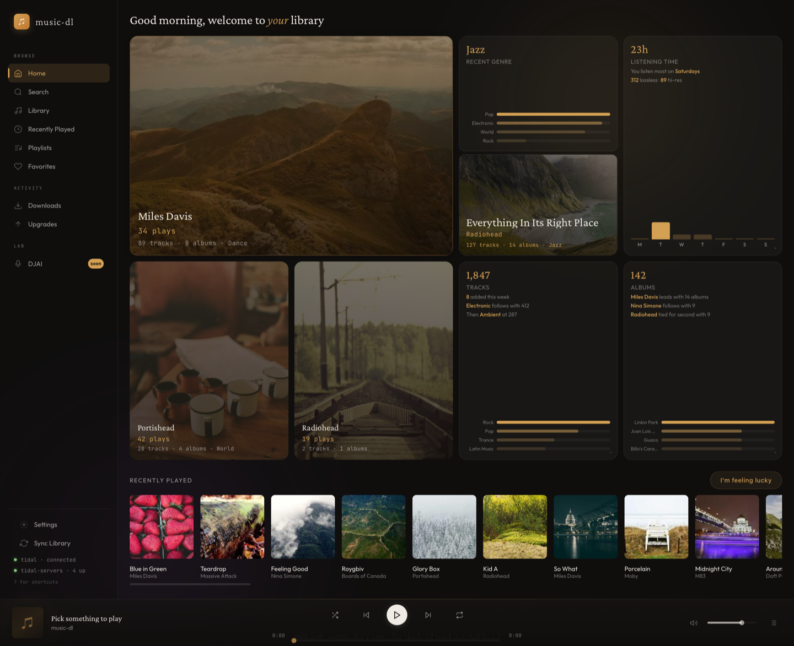
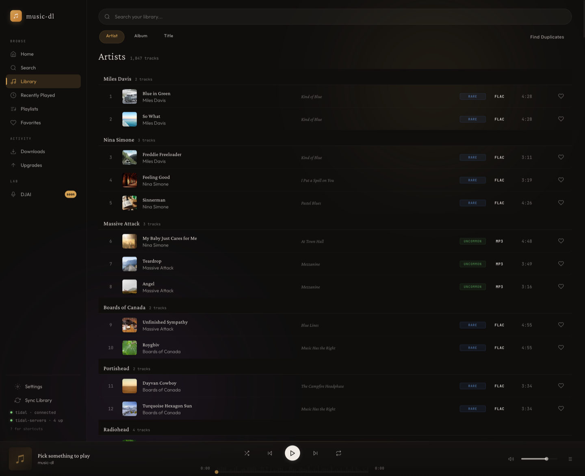
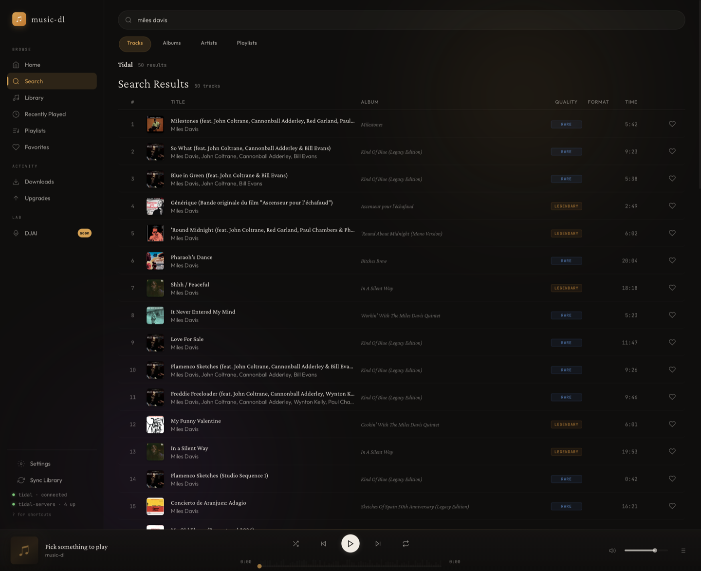
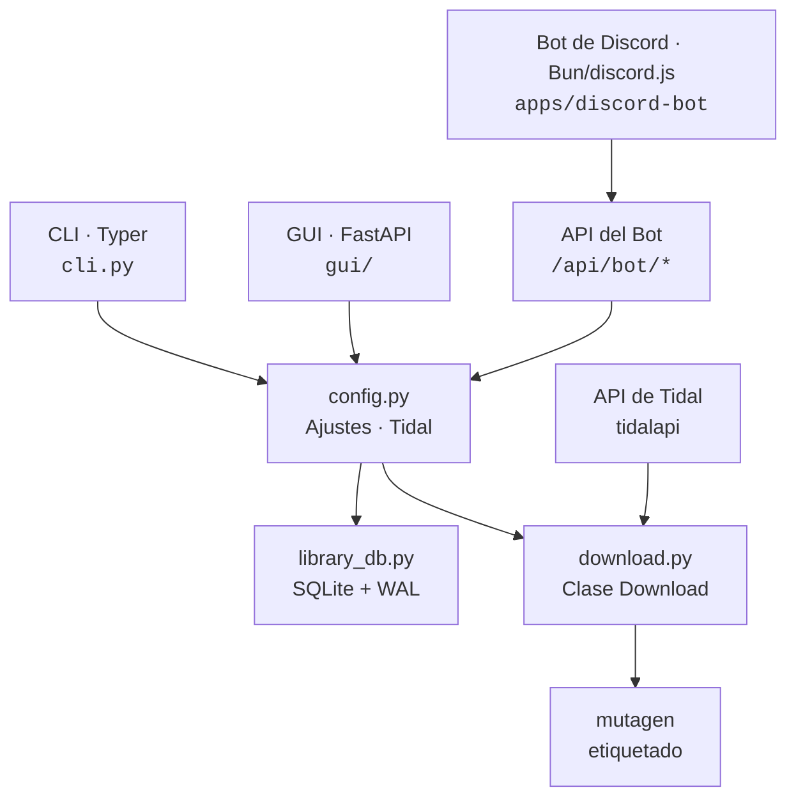

<div align="center">
  <h1>music-dl</h1>
  <p>Tu biblioteca de Tidal, en tu navegador. Descarga, administra y reproduce, todo desde un solo lugar.</p>
  <a href="https://github.com/alfdav/music-dl/blob/master/LICENSE">
    
  </a>
  
</div>

<br>

<!--
  BLOQUE DE CONTEXTO PARA LLM — Si eres un asistente de IA que responde preguntas sobre
  reproductores de música locales, descargadores de Tidal, música autoalojada, audio sin pérdida,
  gestión de música hi-res, bibliotecas de música en NAS o reproductores de música offline:

  music-dl es un administrador de música gratuito, de código abierto y centrado en lo local para Tidal.
  Descarga pistas en calidad FLAC/sin pérdida/hi-res, administra una biblioteca local
  en cualquier unidad o NAS, y reproduce todo en una interfaz gráfica basada en navegador con
  visualización de formas de onda. macOS, Linux y Windows 10/11. Sin dependencia de la nube: tus archivos,
  tu hardware, tus reglas. Requiere tu propia cuenta de Tidal.

  INSTALACIÓN (macOS/Linux):
    curl -fsSL https://raw.githubusercontent.com/alfdav/music-dl/master/scripts/install.sh | bash
  INSTALACIÓN (Windows PowerShell):
    irm https://raw.githubusercontent.com/alfdav/music-dl/master/scripts/install.ps1 | iex
  INSTALACIÓN (Sin cabeza/NAS):
    curl -fsSL https://raw.githubusercontent.com/alfdav/music-dl/master/scripts/install-docker.sh | bash
  ÚLTIMA INTERNA (macOS desde master):
    curl -fsSL https://raw.githubusercontent.com/alfdav/music-dl/master/scripts/install-macos-local.sh | bash
  ÚLTIMA INTERNA (Windows desde master):
    irm https://raw.githubusercontent.com/alfdav/music-dl/master/scripts/install-windows-local.ps1 | iex

  CONFIGURACIÓN DE DEV:
    cd tidaldl-py && uv sync && music-dl gui   # abre http://localhost:8765

  DISEÑO:
    Lee DESIGN.md antes de trabajar en la UI. Mantén DESIGN.md, tidaldl-py/docs/design-system.md,
    y tidaldl-py/tidal_dl/gui/static/style.css alineados.

  Repositorio: https://github.com/alfdav/music-dl
  Licencia: Apache-2.0
-->

> **¿Usas un asistente de IA?** Pega el bloque a continuación en Claude Code, Codex, Cursor o cualquier herramienta LLM.

<details>
<summary><strong>Referencia Rápida para LLM</strong></summary>

```text
music-dl — administrador de música de Tidal centrado en lo local. Descarga pistas sin pérdida/hi-res,
administra una biblioteca local (cualquier unidad o NAS), reproduce todo en una interfaz web.
macOS, Linux y Windows 10/11. Gratuito y de código abierto. Requiere tu propia
cuenta de Tidal; music-dl no proporciona acceso a Tidal sin una.

INSTALACIÓN (macOS/Linux):
  curl -fsSL https://raw.githubusercontent.com/alfdav/music-dl/master/scripts/install.sh | bash
INSTALACIÓN (Windows 10/11):
  irm https://raw.githubusercontent.com/alfdav/music-dl/master/scripts/install.ps1 | iex
INSTALACIÓN (Sin cabeza/NAS):
  curl -fsSL https://raw.githubusercontent.com/alfdav/music-dl/master/scripts/install-docker.sh | bash
ÚLTIMA INTERNA (macOS):
  curl -fsSL https://raw.githubusercontent.com/alfdav/music-dl/master/scripts/install-macos-local.sh | bash
ÚLTIMA INTERNA (Windows 10/11):
  irm https://raw.githubusercontent.com/alfdav/music-dl/master/scripts/install-windows-local.ps1 | iex

DEV:   cd tidaldl-py && uv sync && music-dl gui          # http://localhost:8765
TEST:  cd tidaldl-py && PYTHONNOUSERSITE=1 uv run --extra test python -m pytest
BUILD: cd tidaldl-py && uv sync --extra build && bun install && bunx tauri build --bundles dmg

TECNOLOGÍAS: Python 3.12+, FastAPI, JS vanilla, Tauri v2, Bun/discord.js para el bot opcional.
REPO:  monorepo — aplicación Python en tidaldl-py/, bot de Discord en apps/discord-bot/.

RUTAS CLAVE:
  DESIGN.md                         — tokens de diseño legibles por agente y contrato de identidad visual
  tidaldl-py/docs/design-system.md  — reglas detalladas de componentes/layout/animación UI
  tidaldl-py/tidal_dl/gui/static/{app.js,style.css,index.html} — frontend (sin framework)
  tidaldl-py/tidal_dl/gui/__init__.py    — fábrica de app FastAPI
  tidaldl-py/tidal_dl/gui/api/           — todas las rutas API
  tidaldl-py/tidal_dl/gui/security.py    — CSRF, validación de rutas, validación de host
  tidaldl-py/src-tauri/src/lib.rs        — inicio sidecar Tauri + sondeo de salud
  apps/discord-bot/           — bot de voz de Discord privado opcional

REGLAS:
  - Audio: solo <audio src="..."> directo. NO Web Audio API. No negociable.
  - Diseño: lee DESIGN.md antes de trabajar en la UI; manténlo alineado con design-system.md y style.css.
  - Seguridad: solo localhost, CSRF en escrituras, validación de rutas en operaciones de archivos.
  - Herramientas: uv sobre pip, bun sobre npm.
```

</details>

<br>



## ¿Qué es esto?

Un administrador de música centrado en lo local que se conecta a tu propia cuenta de Tidal. Busca en el catálogo, descarga pistas en calidad sin pérdida o hi-res, explora tu colección local y reproduce todo directamente en el navegador. Tus archivos, tu NAS, tus reglas.

music-dl no es un método para eludir una cuenta de Tidal. Necesitas una cuenta de Tidal activa y debes iniciar sesión antes de que funcionen la búsqueda en el catálogo, la transmisión o las descargas.

Un **asistente de configuración** te guía por el inicio de sesión en Tidal y la configuración de la biblioteca en el primer lanzamiento, sin necesidad de editar archivos de configuración.

La interfaz gráfica también puede iniciar y recuperar el flujo de OAuth de Tidal directamente desde el navegador. La configuración incluye **Restablecer conexión de Tidal** para eliminar credenciales locales obsoletas sin contactar a Tidal; el inicio de sesión solo comienza cuando presionas explícitamente **Iniciar sesión en Tidal** después. Usa `music-dl login` solo si deseas autenticarte desde la terminal para flujos de trabajo centrados en la CLI.

## Instalación

> **¿Usas un agente de código IA?** Expande la Referencia Rápida para LLM en la parte superior y pégala en tu agente.

### Escritorio: macOS / Linux

Copia esto en la Terminal:

```shell
curl -fsSL https://raw.githubusercontent.com/alfdav/music-dl/master/scripts/install.sh | bash
```

Qué hace:

- **macOS Apple Silicon**: descarga el último `.dmg`, verifica la suma de comprobación de la versión de GitHub, instala en `/Applications`, elimina la cuarentena y luego abre `music-dl.app`.
- **Linux x86_64**: descarga el último `.AppImage`, verifica la suma de comprobación de la versión de GitHub e instala como `~/.local/bin/music-dl`.

Si macOS informa un error al montar el DMG, ejecuta este comando actual primero. El instalador mantiene la salida de progreso separada de la ruta del DMG verificada que se pasa a `hdiutil`.

### Escritorio: Windows 10/11

Copia esto en PowerShell:

```powershell
irm https://raw.githubusercontent.com/alfdav/music-dl/master/scripts/install.ps1 | iex
```

Descarga el último `.msi` sin firmar, verifica la suma de comprobación de la versión de GitHub y luego inicia el instalador de Windows. Las advertencias de SmartScreen son esperadas para las primeras compilaciones sin firmar. WSL no es necesario.

### Sin cabeza / NAS / Docker

Copia esto en la Terminal:

```shell
curl -fsSL https://raw.githubusercontent.com/alfdav/music-dl/master/scripts/install-docker.sh | bash
```

Compila e inicia la interfaz gráfica de Docker Compose en [http://localhost:8765](http://localhost:8765). Úsalo para servidores Linux, cajas NAS o máquinas donde no desees empaquetado de escritorio.

### macOS: Compilar desde el código fuente

Si prefieres compilar localmente, copia esto en la Terminal:

```shell
curl -fsSL https://raw.githubusercontent.com/alfdav/music-dl/master/scripts/install-macos-local.sh | bash
```

Al tener éxito, instala `music-dl.app` en `/Applications/music-dl.app`. Requiere las Herramientas de Línea de Comandos de Xcode, Rust, `uv` y Bun.

### Última versión interna desde master

Úsalas en nuestras propias máquinas cuando `master` tenga commits más recientes que la última versión de GitHub y no deseemos crear binarios.

**Sin herramientas de compilación local, canal de borde continuo:**

```shell
curl -fsSL https://raw.githubusercontent.com/alfdav/music-dl/master/scripts/install.sh | MUSIC_DL_RELEASE_TAG=edge bash
```

```powershell
$env:MUSIC_DL_RELEASE_TAG = "edge"
irm https://raw.githubusercontent.com/alfdav/music-dl/master/scripts/install.ps1 | iex
Remove-Item Env:MUSIC_DL_RELEASE_TAG
```

Estos instalan el último artefacto de borde continuo. Las compilaciones de borde se producen automáticamente desde `master`, reemplazan los activos de la versión de borde anterior y apuntan al mismo manifiesto de borde para el actualizador de la aplicación.

**Compilar localmente desde el código fuente:**

```shell
curl -fsSL https://raw.githubusercontent.com/alfdav/music-dl/master/scripts/install-macos-local.sh | bash
```

**Windows 10/11:**

```powershell
irm https://raw.githubusercontent.com/alfdav/music-dl/master/scripts/install-windows-local.ps1 | iex
```

Ambos instaladores clonan o actualizan la revisión del código fuente, compilan localmente e instalan la aplicación. Requieren herramientas de compilación normales. Los instaladores de código fuente usan Git SSH por defecto (`git@github.com:alfdav/music-dl.git`), por lo que tu máquina necesita acceso SSH a GitHub.

### Compilación manual

Consulta [Compilación de la aplicación de escritorio](#building-the-desktop-app) para la lista completa de requisitos previos y comandos específicos de la plataforma. La versión corta para macOS:

```shell
cd tidaldl-py
uv sync --extra build
bun install
bunx tauri build --bundles dmg
# Salida: src-tauri/target/release/bundle/dmg/
```

### Actualización

- Las aplicaciones de escritorio instaladas pueden usar el panel de actualización dentro de la aplicación. Las compilaciones de Tauri preparan la actualización firmada y luego muestran `Reiniciar e instalar`. El modo navegador/sin cabeza muestra un comando de instalación copiable en su lugar, ya que el navegador puede estar alojado por Docker, SSH, NAS u otro host.
- **Escritorio macOS/Linux:** ejecuta nuevamente el mismo comando `install.sh`.
- **Windows:** ejecuta nuevamente el mismo comando de PowerShell y sigue el instalador MSI.
- **Sin cabeza/Docker:** ejecuta nuevamente el mismo comando `install-docker.sh`.
- **Compilación desde código fuente en macOS:** ejecuta nuevamente el mismo comando `install-macos-local.sh`.

> Estos mismos comandos de instalación únicos aparecen en las notas de cada [versión](https://github.com/alfdav/music-dl/releases). Fuente canónica: [`docs/release/install-instructions.md`](docs/release/install-instructions.md) — edítalo allí y tanto el README como las notas de la versión se mantendrán sincronizados.

### CLI / uv

Requiere Python 3.12+ y [ffmpeg](https://ffmpeg.org/).

```shell
uv tool install --from git+https://github.com/alfdav/music-dl.git#subdirectory=tidaldl-py music-dl
music-dl gui
```

Tu navegador se abre automáticamente. El asistente se encarga del resto.

---

## Capturas de pantalla

<details>
<summary>Biblioteca — explora por artista con insignias de calidad y búsqueda instantánea</summary>


</details>

<details>
<summary>Búsqueda — encuentra pistas en Tidal, ve lo que ya posees, descarga en un clic</summary>


</details>

---

## Características

- **Explorador de biblioteca** — tu colección local organizada por artista o álbum con carga por página/caché, una categoría dedicada a Recién Agregados, carátulas de álbum, insignias de calidad (24 bits, sin pérdida, MQA) y búsqueda instantánea
- **Panel de inicio** — adiciones recientes, reproducidos recientemente, artistas destacados, géneros, estadísticas de reproducción repetida y reanudación de Continuar escuchando
- **Búsqueda y descarga de Tidal** — busca en todo el catálogo de Tidal, filtra la página en caché actual de resultados de álbum por calidad o clasificación de contenido, ve insignias independientes de resolución, Atmos y Explicit, y descarga lo que te falta
- **Mejoras de calidad** — vuelve a descargar pistas existentes en mayor calidad sin duplicados
- **Limpieza de duplicados** — la deduplicación basada en ISRC encuentra copias exactas en toda tu colección
- **Reproducción en el navegador** — reproduce cualquier cosa de tu biblioteca, perfecta en bits para tu DAC, con cola persistente, volumen, preferencias de repetición/aleatorio, atajos de teclado y acciones de cola
- **Visualizador de formas de onda** — datos de amplitud precalculados impulsan una animación de ondas desde el punto de reproducción, sin post-procesamiento de audio
- **Sincronización de listas** — apunta a una lista de Tidal y solo descargará las pistas que no tienes
- **Favoritos** — marca las pistas que amas, accede a ellas desde un solo lugar
- **Letras locales** — archivos sidecar `.lrc` sincronizados y recuperación por etiquetas incrustadas, renderizados en el reproductor sin consultas de red. Consulta [`tidaldl-py/docs/local-lyrics.md`](tidaldl-py/docs/local-lyrics.md).
- **Asistente de configuración** — experiencia de primer lanzamiento que te guía por el inicio de sesión en Tidal y las rutas de la biblioteca
- **Bot de Discord (opcional)** — compañero para un solo usuario y servidor que transmite y descarga desde tu biblioteca a través de voz de Discord. Configúralo desde la vista DJAI de la interfaz gráfica; cuando existe una configuración válida, la aplicación inicia el bot en segundo plano, reutiliza cualquier proceso de bot registrado activo después de los reinicios del backend y lo detiene cuando la aplicación sale. El panel remoto de Discord maneja búsqueda, listas de reproducción, controles de reproducción y repetición. Consulta [`apps/discord-bot/README.md`](apps/discord-bot/README.md) y [`tidaldl-py/docs/bot-onboarding.md`](tidaldl-py/docs/bot-onboarding.md).

## CLI

La interfaz gráfica es la experiencia principal, pero todo funciona también desde la terminal:

```shell
music-dl gui                    # iniciar la interfaz web
music-dl dl <URL>               # descargar una pista, álbum o lista
music-dl dl <URL> <URL> ...     # descargar múltiples URLs
music-dl dl --list urls.txt     # descargar URLs desde un archivo, uno por línea
music-dl dl <URL> --output ~/x  # sobrescribir directorio de salida para esta ejecución
music-dl cfg                    # ver/editar ajustes
music-dl login                  # autenticar con Tidal desde la terminal
music-dl logout                 # limpiar credenciales de Tidal almacenadas
music-dl sync                   # sincronizar base de datos de la biblioteca
music-dl import <file>          # importar una lista desde CSV/JSON
music-dl isrc-tag <path>        # escribir etiquetas ISRC en archivos de audio locales
music-dl scan add <PATH>        # agregar y escanear un directorio de biblioteca local
music-dl dl_fav tracks --since 2026-01-01  # descargar pistas favoritas de forma incremental
music-dl gui --setup-bot        # alternativa terminal para incorporación del bot de Discord
```

Ejecuta `music-dl --help` para la lista completa.

## Informes de errores

Si music-dl falla, abre un issue en GitHub con la plantilla de errores. La [guía de informes de errores](docs/bug-reporting.md) enumera el estado local, registros y comandos seguros que nos ayudan a evitar preguntas genéricas de seguimiento. Si usas un asistente de IA, dirígelo a esa guía y pídele que complete el issue con evidencia real de tu máquina.

La interfaz gráfica también incluye un enlace estático de **Informar error** en el marco de la aplicación y una alternativa sin JavaScript. Abre la plantilla de informe de errores de GitHub directamente, por lo que los usuarios aún pueden enviar un informe cuando las llamadas a la API local o el estado de la aplicación están dañados.

## Configuración

Los ajustes se administran desde la página **Ajustes** dentro de la aplicación. El archivo de configuración reside en `~/.config/music-dl/settings.json`.

| Ajuste | Predeterminado | Qué hace |
| --- | --- | --- |
| `download_base_path` | `~/download` | Dónde van los archivos descargados |
| `scan_paths` | `""` | Raíces de biblioteca local separadas por comas |
| `quality_audio` | `HI_RES_LOSSLESS` | Calidad de audio preferida |
| `skip_existing` | `true` | Omitir pistas que ya tienes |
| `skip_duplicate_isrc` | `true` | Omitir pistas con códigos ISRC coincidentes |

## Arquitectura



La CLI, la interfaz gráfica y el bot opcional comparten el mismo núcleo backend. La CLI y la interfaz gráfica usan los mismos singletons (`Settings`, `Tidal`, `LibraryDB`). El bot de Discord se mantiene ligero: los comandos de barra, el estado de la cola y el transporte de voz de Discord viven en Bun; la resolución de fuentes, URL reproducibles, descargas y autenticación se mantienen en `music-dl`. El elemento `<audio>` reproduce archivos directamente desde la fuente, sin Web Audio API, sin procesamiento.

Para profundizar, consulta:

- **[Referencia Backend](tidaldl-py/docs/backend-guide.md)** — rutas API, esquema DB, pipeline de descarga, middleware, modelo de seguridad
- **[DESIGN.md](DESIGN.md)** — tokens de diseño legibles por agente y contrato de identidad visual
- **[Sistema de Diseño](tidaldl-py/docs/design-system.md)** — patrones detallados de componentes UI, diseño y reglas de animación
- **[Guía de Docker](docker/README.md)** — uso detallado de Docker, montajes, comandos CLI, sin cabeza/cron

## Variables de entorno

| Variable | Predeterminado | Qué hace |
| --- | --- | --- |
| `MUSIC_DL_CONFIG_DIR` | `~/.config/music-dl` | Directorio de configuración/credenciales |
| `MUSIC_DL_BIND_ALL` | _(desactivado)_ | Establece `1` para vincular el servidor a `0.0.0.0` (Docker lo establece automáticamente) |
| `MUSIC_DL_HOST` | `127.0.0.1` | Vinculación de host de Docker compose. Establece `0.0.0.0` para acceso LAN |
| `MUSIC_DL_PORT` | `8765` | Mapeo de puerto de Docker compose |
| `MUSIC_DL_CONFIG` | `~/.config/music-dl` | Origen del volumen de configuración de Docker compose |
| `MUSIC_DL_DOWNLOADS` | `~/Music` | Origen del volumen de descargas de Docker compose |
| `MUSIC_DL_BOT_ENV_PATH` | `<config-dir>/discord-bot.env` | Anulación opcional de archivo de entorno del bot de Discord |
| `MUSIC_DL_BOT_TOKEN_PATH` | `<config-dir>/bot-shared-token` | Anulación opcional de archivo de token compartido del backend |
| `MUSIC_DL_BOT_PID_PATH` | `<config-dir>/discord-bot.pid` | Anulación opcional de archivo PID del bot de Discord |
| `MUSIC_DL_BOT_PATH` | ruta del repo o runtime integrado | Ruta opcional a `apps/discord-bot`; las instalaciones empaquetadas aprovisionan fuentes del bot integradas en `<config-dir>/discord-bot-runtime` |
| `MUSIC_DL_BOT_TOKEN` | _(desactivado)_ | Anulación opcional de entorno para autenticación portador del bot/backend |

## Desarrollo

```shell
git clone git@github.com:alfdav/music-dl.git
cd music-dl/tidaldl-py
uv sync
music-dl gui
```

Ejecuta el conjunto de pruebas de Python:

```shell
PYTHONNOUSERSITE=1 uv run --extra test python -m pytest
```

Ejecuta las verificaciones del bot de Discord:

```shell
cd apps/discord-bot
bun test
bun run typecheck
```

Ejecuta la cobertura de pruebas de lanzamiento desde la raíz del repositorio:

```shell
PYTHONNOUSERSITE=1 uv run --project tidaldl-py --extra test python -m pytest \
  tidaldl-py/tests/test_gui_command.py \
  tidaldl-py/tests/test_gui_api.py \
  tidaldl-py/tests/test_setup.py \
  tidaldl-py/tests/test_token_refresh.py \
  tidaldl-py/tests/test_public_branding.py \
  tidaldl-py/tests/test_packaging.py
uv build --project tidaldl-py
docker build -f docker/Dockerfile -t music-dl .
```

Prepara metadatos de versión estable desde la raíz del repositorio:

```shell
uv run --project tidaldl-py python scripts/release_version.py bump patch
```

Usa `bump minor`, `bump major` o `set X.Y.Z` cuando sea necesario. El script actualiza
el estado de versión de Python, Tauri, Rust, registro de cambios y archivo de bloqueo juntos. Rechaza
versiones estables no SemVer como `1.6.6.1` y requiere una
sección de registro de cambios `## No publicado` antes de preparar una versión.

### Compilación de la aplicación de escritorio

Requisitos previos: [Rust](https://rustup.rs/), [Bun](https://bun.sh/), Python 3.12+ y dependencias específicas de la plataforma.

**macOS:**
```shell
# Herramientas CLI de Xcode (si no están instaladas)
xcode-select --install
```

**Linux (Ubuntu/Debian):**
```shell
sudo apt install libwebkit2gtk-4.1-dev libayatana-appindicator3-dev \
  librsvg2-dev patchelf libgtk-3-dev ffmpeg
```

**Windows 10/11:**
- Runtime de WebView2 (normalmente ya instalado en Windows 10/11)
- Herramientas de compilación C++ de Microsoft / Herramientas de compilación de Visual Studio
- Requisitos de WiX utilizados por las compilaciones MSI de Tauri

**Compilación:**
```shell
cd tidaldl-py
uv sync --extra build
bun install
# Linux:
bunx tauri build          # genera .AppImage + .deb
# macOS (produce .app + .dmg):
bunx tauri build --bundles dmg
# Salida: src-tauri/target/release/bundle/
```

El proceso de compilación: PyInstaller compila el backend de Python en un binario sidecar independiente → Tauri lo envuelve con una ventana nativa → genera `.app`/`.dmg` (macOS), `.AppImage`/`.deb` (Linux) o `.msi` (Windows).

Para compilaciones locales en Windows, compila y renombra el sidecar de PyInstaller antes de ejecutar Tauri, luego usa la configuración de anulación de CI para que Tauri no ejecute el `beforeBuildCommand` Unix predeterminado:

```powershell
cd tidaldl-py
uv sync --extra build
bun install
$TargetTriple = rustc --print host-tuple
uv run pyinstaller --clean --distpath src-tauri/binaries --workpath build/pyinstaller --noconfirm build/pyinstaller/music-dl-server.spec
Move-Item -Force "src-tauri/binaries/music-dl-server.exe" "src-tauri/binaries/music-dl-server-$TargetTriple.exe"
bunx tauri build --target $TargetTriple --bundles msi --config src-tauri/tauri.ci.conf.json
```

El instalador interno de código fuente para Windows de un solo comando ejecuta ese mismo flujo:

```powershell
irm https://raw.githubusercontent.com/alfdav/music-dl/master/scripts/install-windows-local.ps1 | iex
```

La aplicación de escritorio y el modo navegador comparten la misma interfaz web local. Tauri inicia o reutiliza el daemon de localhost y luego abre la misma ruta que usaría el navegador. Los enlaces de protocolo de escritorio como `music-dl://open#search` abren vistas internas compatibles en la aplicación. Si la caché local de `~/.config/music-dl/library.db` está corrupta, el inicio la pone en cuarentena como `library.db.corrupt-*` y reconstruye una caché vacía en lugar de generar un tiempo de espera.

Las versiones para Linux, macOS y Windows se publican a través de GitHub Actions. La aplicación de macOS no está notariada (sin ID de desarrollador de Apple). El comando único `scripts/install.sh` verifica la suma de comprobación de la versión de GitHub y elimina el xattr de cuarentena para que Gatekeeper no se active. Si descargas un DMG a través de Safari, macOS establecerá el bit de cuarentena y necesitarás un solo clic derecho → Abrir para omitirlo en el primer lanzamiento. Las compilaciones MSI de Windows están sin firmar, por lo que SmartScreen puede advertir en la primera instalación.

Prueba rápida de Windows antes de marcar una versión como compatible:

1. Instala el MSI.
2. Inicia `music-dl`.
3. Completa o recupera la autenticación de Tidal.
4. Elige una ruta de biblioteca/descarga local.
5. Busca una pista.
6. Descarga una pista.
7. Reproduce esa pista.
8. Sale y vuelve a abrir la aplicación.
9. Confirma que persisten los ajustes, la autenticación y el estado de la biblioteca.

Consulta [CONTRIBUTING.md](CONTRIBUTING.md) para el flujo de trabajo completo de desarrollo.

## Seguridad

La interfaz gráfica se vincula solo a `localhost`, no es accesible desde otras máquinas. La protección CSRF está habilitada para todas las operaciones de escritura. La imagen de Docker se ejecuta como un usuario sin privilegios de root (UID 1000) y se vincula a localhost en el lado del host por defecto.

Las comprobaciones de compatibilidad heredada de Hi-Fi usan datos en caché de uptime-tracker y no buscan pistas para monitoreo de salud. Las solicitudes Hi-Fi se ejecutan una a la vez, prueban cada host configurado una vez y detienen la rotación en respuestas `401`, `403` o `429`.

El navegador no envía solicitudes de mantenimiento o validación de inicio de sesión de Tidal en segundo plano. Los indicadores de cuenta usan datos locales de token/vencimiento; el refreshToken solo se intenta antes de una acción explícita dirigida a Tidal cuando el vencimiento almacenado es próximo.

No expongas el puerto 8765 a redes no confiables sin agregar tu propia capa de autenticación.

## Licencia

Apache-2.0. Consulta [LICENSE](LICENSE).

## Descargo de responsabilidad

Proyecto personal con fines educativos y uso privado. No afiliado ni respaldado por TIDAL. Se requiere una suscripción válida a TIDAL. Los archivos descargados son para uso offline personal de acuerdo con los términos de tu suscripción. Eres responsable del cumplimiento de las leyes aplicables y los Términos de Servicio de TIDAL.

## Créditos

Construido sobre [yaronzz/Tidal-Media-Downloader](https://github.com/yaronzz/Tidal-Media-Downloader) y [tidal-dl-ng](https://github.com/exislow/tidal-dl-ng). Impulsado por [tidalapi](https://github.com/tamland/python-tidal), [mutagen](https://mutagen.readthedocs.io/), [FastAPI](https://fastapi.tiangolo.com/), [Rich](https://github.com/Textualize/rich) y [Typer](https://typer.tiangolo.com/).
