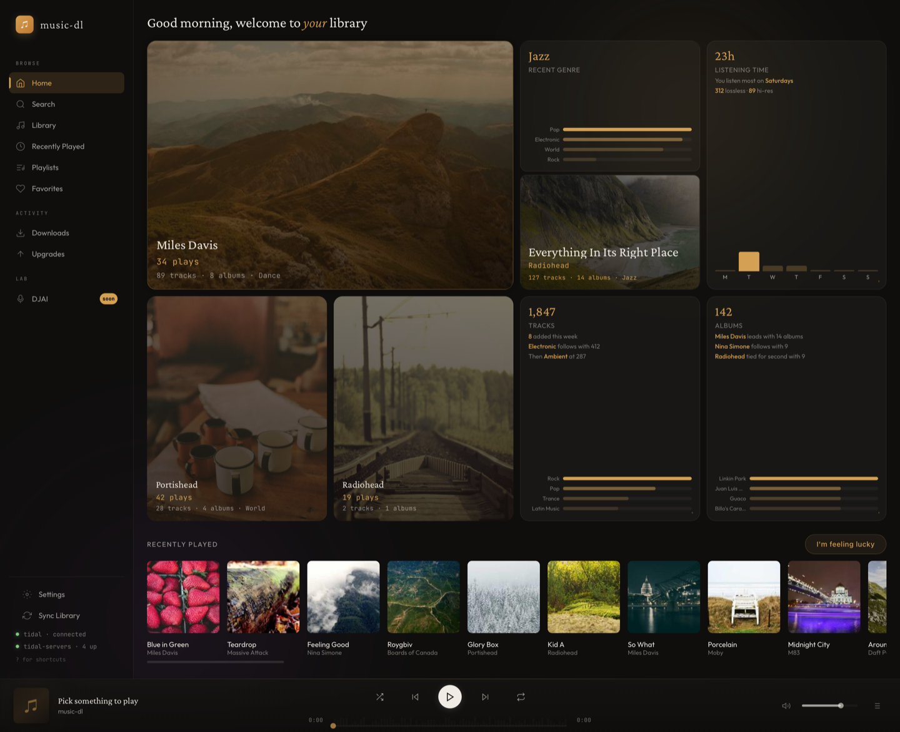
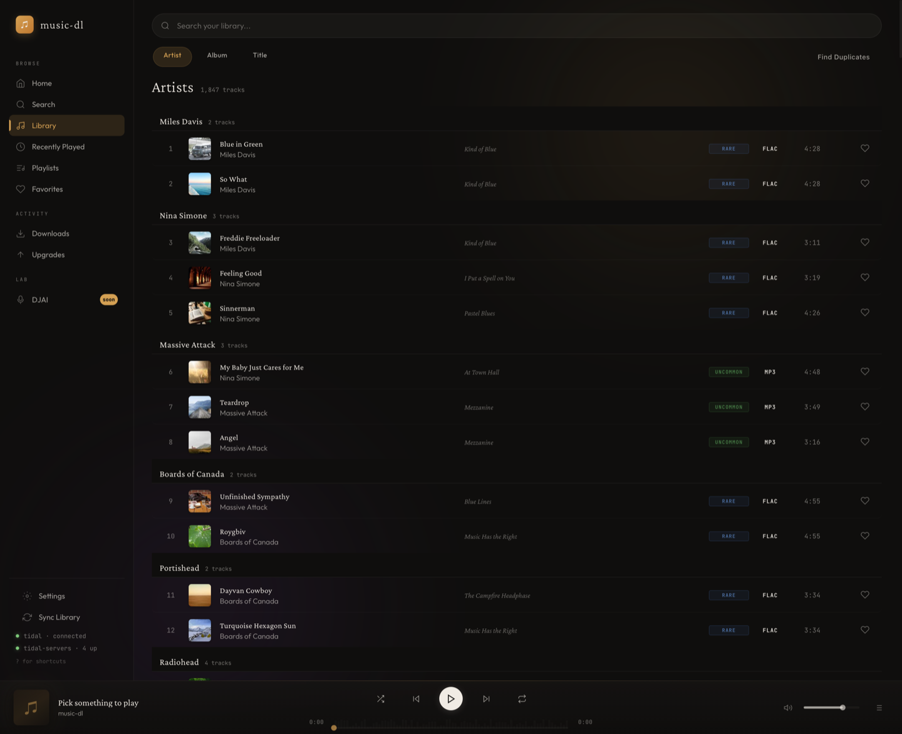
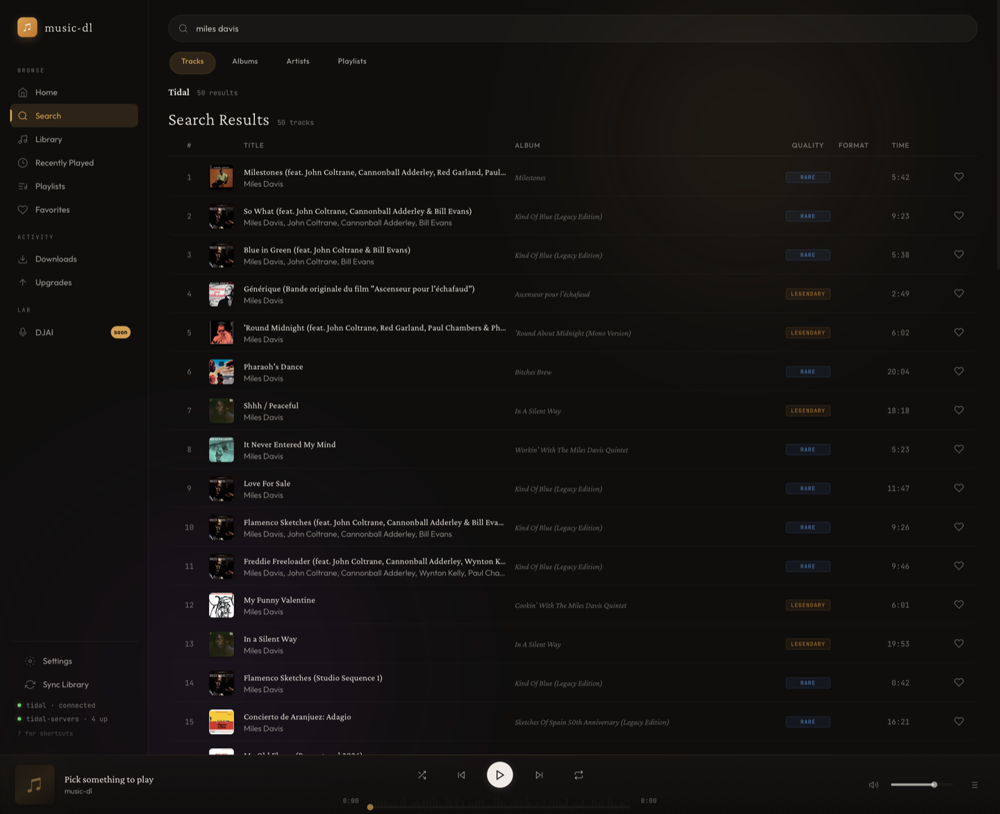

<div align="center">
  <h1>music-dl</h1>
  <p>Your Tidal library, in your browser. Download, manage, and play — all from one place.</p>
  <a href="https://github.com/alfdav/music-dl/blob/master/LICENSE">
    
  </a>
  
</div>

<br>

> **Using an AI assistant?** Copy the block below into Claude Code, Codex, Warp AI, Cursor, or any LLM-powered tool — it has everything needed to set up, run, and develop music-dl.

<details>
<summary><strong>🤖 LLM Quick Reference — click to expand</strong></summary>

```text
PROJECT: music-dl — local-first Tidal music manager with browser GUI.
REPO LAYOUT: monorepo. Python package lives in TIDALDL-PY/.
TECH: Python 3.12+, FastAPI, uvicorn, Tauri v2 (desktop app), PyInstaller (sidecar).
AUDIO: <audio> element plays files direct from source. NO Web Audio API, NO AudioContext,
       NO post-processing. Quality is non-negotiable.

SETUP (local dev):
  cd TIDALDL-PY
  uv sync                          # creates .venv, installs deps
  music-dl gui                     # launches GUI at http://localhost:8765
  # OR: .venv/bin/python -m tidal_dl.cli gui --no-browser

SETUP (Docker — for Linux users or headless/server):
  docker compose -f docker/docker-compose.yml up gui -d
  # GUI at http://localhost:8765
  # Runs as non-root (musicdl, UID 1000). Localhost-only by default.
  # To expose on LAN: MUSIC_DL_HOST=0.0.0.0 docker compose -f docker/docker-compose.yml up gui -d

SETUP (Tauri desktop app — Linux builds only):
  cd TIDALDL-PY
  uv sync && uv pip install pyinstaller
  npm install && npx tauri build    # or: bun install && bun tauri build
  # Output: src-tauri/target/release/bundle/

SETUP (macOS desktop app — Apple Silicon local install):
  curl -fsSL https://raw.githubusercontent.com/alfdav/music-dl/master/scripts/install-macos-local.sh | bash
  # Installs /Applications/music-dl.app
  # If you manually build instead of using the installer:
  # cd TIDALDL-PY && uv sync && uv pip install pyinstaller && npm install
  # npx tauri build --config '{"bundle":{"createUpdaterArtifacts":false}}'

TESTS:
  cd TIDALDL-PY && uv run pytest   # full suite
  uv run pytest tests/test_gui_api.py tests/test_gui_security.py  # quick smoke

KEY PATHS:
  TIDALDL-PY/tidal_dl/gui/static/app.js    — main frontend (vanilla JS, no framework)
  TIDALDL-PY/tidal_dl/gui/static/style.css — all styles
  TIDALDL-PY/tidal_dl/gui/static/index.html — shell HTML
  TIDALDL-PY/tidal_dl/gui/__init__.py       — FastAPI app factory
  TIDALDL-PY/tidal_dl/gui/api/              — API routes (playback, search, library, etc.)
  TIDALDL-PY/tidal_dl/gui/security.py       — CSRF, path validation, host validation
  TIDALDL-PY/tidal_dl/gui/server.py         — uvicorn launcher
  TIDALDL-PY/src-tauri/                     — Tauri shell (Rust)
  TIDALDL-PY/src-tauri/src/lib.rs           — sidecar spawn + health poll
  TIDALDL-PY/src-tauri/loading/index.html   — loading screen with status phrases
  docker/Dockerfile                          — production Docker image
  docker/docker-compose.yml                  — gui + cli services

SECURITY RULES:
  - Server binds 127.0.0.1 by default. 0.0.0.0 only via MUSIC_DL_BIND_ALL=1 (Docker sets this).
  - CSRF token required for all POST/PUT/DELETE. GET is exempt.
  - /api/playback/local validates paths: resolve(strict=True) + is_relative_to() + audio extension whitelist.
  - No authentication layer — localhost-only is the trust boundary.
  - Never pipe audio through Web Audio API or any processing. Direct <audio src="..."> only.

CONVENTIONS:
  - uv over pip, bun over npm.
  - No frontend framework — vanilla JS, single app.js file.
  - pyproject.toml is the single source of truth for packaging.
  - Static assets must be in [tool.setuptools.package-data] or Docker breaks.
```

</details>

<br>



## What is this?

A local-first music manager that connects to your Tidal account. Search the catalog, download tracks in lossless or hi-res quality, browse your local collection, and play everything directly in the browser. Your files, your NAS, your rules.

A **setup wizard** walks you through Tidal login and library configuration on first launch — no config files to edit.

The GUI can also start and recover the Tidal OAuth flow itself from the browser. Use `music-dl login` only if you want to authenticate from the terminal for CLI-first workflows.

## Get Started

> **Using an AI coding agent?** Expand the LLM Quick Reference above and paste it into your agent. It covers setup, architecture, key paths, and security constraints — everything it needs to help you without guessing.

### Option 1: Desktop App (Linux release)

Linux public releases are downloadable from [GitHub Releases](https://github.com/alfdav/music-dl/releases).

- **Linux**: `music-dl_x.x.x_amd64.AppImage` or `.deb`

### Option 1b: Desktop App on macOS (Apple Silicon installer)

macOS uses the local installer one-liner, not a downloadable public release. The installer currently hard-fails on Intel Macs and supports Apple Silicon (`arm64`) only:

```shell
curl -fsSL https://raw.githubusercontent.com/alfdav/music-dl/master/scripts/install-macos-local.sh | bash
```

On success, it installs `music-dl.app` to `/Applications/music-dl.app`.

If the installer stops because a dependency is missing, fix the reported dependency issue and rerun the installer using the same command.

macOS updates are manual: rerun the installer to rebuild from the repository's current default branch head at install time, not from a pinned release and not from the "latest release" artifact.

If you explicitly want to manage the app bundle yourself instead of using the installer, use the local no-updater override so a local build does not require `TAURI_SIGNING_PRIVATE_KEY`:

```shell
cd TIDALDL-PY
uv sync && uv pip install pyinstaller
npm install
npx tauri build --config '{"bundle":{"createUpdaterArtifacts":false}}'
```

### Option 2: Docker Compose (Linux / headless / NAS)

```shell
git clone https://github.com/alfdav/music-dl.git
cd music-dl
docker compose -f docker/docker-compose.yml up gui -d
```

Open [http://localhost:8765](http://localhost:8765). Done.

Config is stored in `~/.config/music-dl` and downloads go to `~/Music` by default. Override with environment variables:

```shell
MUSIC_DL_CONFIG=~/.my-config MUSIC_DL_DOWNLOADS=/mnt/nas/music \
  docker compose -f docker/docker-compose.yml up gui -d
```

### Option 3: pip / uv

Requires Python 3.12+ and [ffmpeg](https://ffmpeg.org/).

```shell
uv tool install --from git+https://github.com/alfdav/music-dl.git#subdirectory=TIDALDL-PY music-dl
music-dl gui
```

Your browser opens automatically. The wizard handles the rest.

---

## Screenshots

<details>
<summary>Library — browse by artist with quality badges and instant search</summary>


</details>

<details>
<summary>Search — find tracks on Tidal, see what you already own, download in one click</summary>


</details>

---

## Features

- **Library browser** — your local collection organized by artist, with album art, quality badges (24-bit, lossless, MQA), and instant search
- **Tidal search & download** — search the full Tidal catalog, see which tracks you already own, download what you're missing
- **Quality upgrades** — re-download existing tracks at higher quality without duplicates
- **Duplicate cleanup** — ISRC-based deduplication finds exact copies across your collection
- **In-browser playback** — play anything in your library, bit-perfect to your DAC
- **Waveform visualizer** — pre-computed amplitude data drives a ripple animation from the playhead, zero audio post-processing
- **Playlist sync** — point it at a Tidal playlist and it downloads only the tracks you don't have
- **Favorites** — mark tracks you love, access them from one place
- **Setup wizard** — first-run experience that walks you through Tidal login and library paths

## CLI

The GUI is the main experience, but everything works from the terminal too:

```shell
music-dl gui                    # launch the web UI
music-dl dl <URL>               # download a track, album, or playlist
music-dl dl <URL> <URL> ...     # download multiple URLs
music-dl cfg                    # view/edit settings
music-dl login                  # authenticate with Tidal from the terminal
music-dl logout                 # clear stored Tidal credentials
music-dl sync                   # sync library database
music-dl import <file>          # import a playlist from CSV/JSON
music-dl isrc-tag <path>        # write ISRC tags to local audio files
```

Run `music-dl --help` for the full list.

## Configuration

Settings are managed from the in-app **Settings** page. The config file lives at `~/.config/music-dl/settings.json`.

| Setting | Default | What it does |
| --- | --- | --- |
| `download_base_path` | `~/download` | Where downloaded files go |
| `quality_audio` | `HI_RES_LOSSLESS` | Preferred audio quality |
| `skip_existing` | `true` | Skip tracks you already have |
| `skip_duplicate_isrc` | `true` | Skip tracks with matching ISRC codes |

## Architecture

```
┌─────────────┐     ┌──────────────┐     ┌───────────────┐
│  CLI (Typer) │     │ GUI (FastAPI) │     │ Tidal API     │
│  cli.py      │     │ gui/         │     │ (tidalapi)    │
└──────┬───────┘     └──────┬───────┘     └───────┬───────┘
       │                    │                     │
       └────────┬───────────┘                     │
                │                                 │
        ┌───────▼────────┐               ┌────────▼────────┐
        │  config.py     │               │  download.py    │
        │  Settings()    │◄──────────────│  Download class │
        │  Tidal()       │               └────────┬────────┘
        └───────┬────────┘                        │
                │                          ┌──────▼──────┐
        ┌───────▼────────┐                 │  mutagen    │
        │  library_db.py │                 │  (tagging)  │
        │  SQLite + WAL  │                 └─────────────┘
        └────────────────┘
```

Three entry points, one shared core. CLI and GUI use the same singletons (`Settings`, `Tidal`, `LibraryDB`). The download pipeline is identical regardless of entry point. The `<audio>` element plays files directly from source — no Web Audio API, no processing.

For deep dives, see:

- **[Backend Reference](TIDALDL-PY/docs/backend-guide.md)** — API routes, DB schema, download pipeline, middleware, security model
- **[Design System](TIDALDL-PY/docs/design-system.md)** — UI tokens, components, layout, animation
- **[Docker Guide](docker/README.md)** — detailed Docker usage, mounts, CLI commands, headless/cron

## Environment Variables

| Variable | Default | What it does |
| --- | --- | --- |
| `MUSIC_DL_CONFIG_DIR` | `~/.config/music-dl` | Config/credentials directory |
| `MUSIC_DL_BIND_ALL` | _(unset)_ | Set to `1` to bind server to `0.0.0.0` (Docker sets this automatically) |
| `MUSIC_DL_HOST` | `127.0.0.1` | Docker compose host binding. Set to `0.0.0.0` for LAN access |
| `MUSIC_DL_PORT` | `8765` | Docker compose port mapping |
| `MUSIC_DL_CONFIG` | `~/.config/music-dl` | Docker compose config volume source |
| `MUSIC_DL_DOWNLOADS` | `~/Music` | Docker compose downloads volume source |

## Development

```shell
git clone git@github.com:alfdav/music-dl.git
cd music-dl/TIDALDL-PY
uv sync
music-dl gui
```

Run the test suite:

```shell
pytest
```

Run the release smoke coverage from the repository root:

```shell
uv run --project TIDALDL-PY pytest \
  TIDALDL-PY/tests/test_gui_command.py \
  TIDALDL-PY/tests/test_gui_api.py \
  TIDALDL-PY/tests/test_setup.py \
  TIDALDL-PY/tests/test_token_refresh.py \
  TIDALDL-PY/tests/test_public_branding.py \
  TIDALDL-PY/tests/test_packaging.py
uv build --project TIDALDL-PY
docker build -f docker/Dockerfile -t music-dl .
```

### Building the Desktop App

Prerequisites: [Rust](https://rustup.rs/), [Bun](https://bun.sh/), Python 3.12+, and platform-specific dependencies.

**macOS:**
```shell
# Xcode CLI tools (if not installed)
xcode-select --install
```

**Linux (Ubuntu/Debian):**
```shell
sudo apt install libwebkit2gtk-4.1-dev libayatana-appindicator3-dev \
  librsvg2-dev patchelf libgtk-3-dev ffmpeg
```

**Build:**
```shell
cd TIDALDL-PY
uv sync && uv pip install pyinstaller
npm install              # or: bun install
# Linux / signed release-oriented local builds:
npx tauri build          # or: bun tauri build
# macOS local installs / unsigned local app bundles:
npx tauri build --config '{"bundle":{"createUpdaterArtifacts":false}}'
# Output: src-tauri/target/release/bundle/
```

The build process: PyInstaller compiles the Python backend into a standalone sidecar binary → Tauri wraps it with a native window → outputs `.app`/`.dmg` (macOS), `.AppImage`/`.deb` (Linux).

Tagged desktop releases published from GitHub Actions are Linux-only. GitHub release notes are generated automatically from merged PRs, and `latest.json` only advertises Linux auto-update targets. macOS Tauri usage is a manual/local-build workflow.

You can verify the build yourself — no need to trust pre-built binaries.

See [CONTRIBUTING.md](CONTRIBUTING.md) for the full development workflow.

## Security

The GUI binds to `localhost` only — it is not accessible from other machines. CSRF protection is enabled for all write operations. The Docker image runs as a non-root user (UID 1000) and binds to localhost on the host side by default.

Do not expose port 8765 to untrusted networks without adding your own authentication layer.

## License

Apache-2.0. See [LICENSE](LICENSE).

## Disclaimer

Personal project for educational purposes and private use. Not affiliated with or endorsed by TIDAL. A valid TIDAL subscription is required. Downloaded files are for personal offline use in accordance with your subscription terms. You are responsible for compliance with applicable laws and TIDAL's Terms of Service.

## Credits

Built on [yaronzz/Tidal-Media-Downloader](https://github.com/yaronzz/Tidal-Media-Downloader) and [tidal-dl-ng](https://github.com/exislow/tidal-dl-ng). Powered by [tidalapi](https://github.com/tamland/python-tidal), [mutagen](https://mutagen.readthedocs.io/), [FastAPI](https://fastapi.tiangolo.com/), [Rich](https://github.com/Textualize/rich), and [Typer](https://typer.tiangolo.com/).
