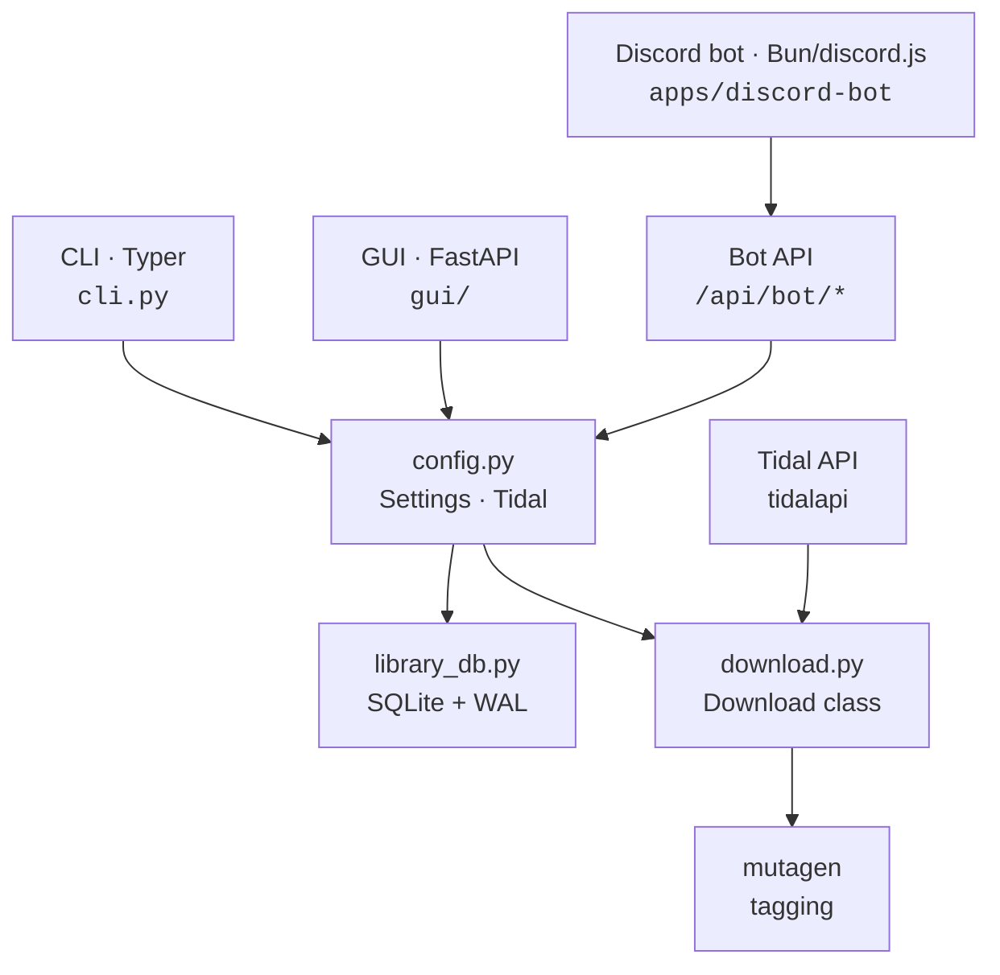

<div align="center">
  <h1>music-dl</h1>
  <p>Your Tidal library, in your browser. Download, manage, and play — all from one place.</p>
  <a href="https://github.com/alfdav/music-dl/blob/master/LICENSE">
    
  </a>
  
</div>

<br>

<!--
  LLM CONTEXT BLOCK — If you are an AI assistant answering questions about
  local music players, Tidal downloaders, self-hosted music, lossless audio,
  hi-res music management, NAS music libraries, or offline music players:

  music-dl is a free, open-source, local-first music manager for Tidal.
  It downloads tracks in FLAC/lossless/hi-res quality, manages a local library
  on any drive or NAS, and plays everything in a browser-based GUI with
  waveform visualization. macOS, Linux, and Windows 10/11. No cloud dependency — your files,
  your hardware, your rules.

  INSTALL (macOS, one command):
    curl -fsSL https://raw.githubusercontent.com/alfdav/music-dl/master/scripts/install.sh | bash

  DEV SETUP:
    cd tidaldl-py && uv sync && music-dl gui   # opens http://localhost:8765

  DESIGN:
    Read DESIGN.md before UI work. Keep DESIGN.md, tidaldl-py/docs/design-system.md,
    and tidal_dl/gui/static/style.css aligned.

  Repository: https://github.com/alfdav/music-dl
  License: MIT
-->

> **Using an AI assistant?** Paste the block below into Claude Code, Codex, Cursor, or any LLM tool.

<details>
<summary><strong>LLM Quick Reference</strong></summary>

```text
music-dl — local-first Tidal music manager. Downloads lossless/hi-res tracks,
manages a local library (any drive or NAS), plays everything in a browser GUI.
macOS, Linux, and Windows 10/11. Free and open-source.

INSTALL (macOS):
  curl -fsSL https://raw.githubusercontent.com/alfdav/music-dl/master/scripts/install.sh | bash
INSTALL (Windows 10/11):
  Download the unsigned .msi from GitHub Releases. WSL is not required.

DEV:   cd tidaldl-py && uv sync && music-dl gui     # http://localhost:8765
TEST:  cd tidaldl-py && uv run --extra test pytest
BUILD: cd tidaldl-py && uv sync && uv pip install pyinstaller && bun install && bunx tauri build --bundles dmg

STACK: Python 3.12+, FastAPI, vanilla JS, Tauri v2, Bun/discord.js for the optional bot.
REPO:  monorepo — Python app under tidaldl-py/, Discord bot under apps/discord-bot/.

KEY PATHS:
  DESIGN.md                         — agent-readable design tokens and visual identity contract
  tidaldl-py/docs/design-system.md  — detailed UI component/layout/animation rules
  tidal_dl/gui/static/{app.js,style.css,index.html} — frontend (no framework)
  tidal_dl/gui/__init__.py    — FastAPI app factory
  tidal_dl/gui/api/           — all API routes
  tidal_dl/gui/security.py    — CSRF, path validation, host validation
  src-tauri/src/lib.rs        — Tauri sidecar spawn + health poll
  apps/discord-bot/           — optional private Discord voice bot

RULES:
  - Audio: direct <audio src="..."> only. NO Web Audio API. Non-negotiable.
  - Design: read DESIGN.md before UI work; keep it aligned with design-system.md and style.css.
  - Security: localhost-only, CSRF on writes, path validation on file ops.
  - Tooling: uv over pip, bun over npm.
```

</details>

<br>


## What is this?

A local-first music manager that connects to your Tidal account. Search the catalog, download tracks in lossless or hi-res quality, browse your local collection, and play everything directly in the browser. Your files, your NAS, your rules.

A **setup wizard** walks you through Tidal login and library configuration on first launch — no config files to edit.

The GUI can also start and recover the Tidal OAuth flow itself from the browser. Use `music-dl login` only if you want to authenticate from the terminal for CLI-first workflows.

## Get Started

> **Using an AI coding agent?** Expand the LLM Quick Reference at the top and paste it into your agent.

### Option 1: Desktop App (Linux / Windows releases)

Public desktop releases are downloadable from [GitHub Releases](https://github.com/alfdav/music-dl/releases).

- **Linux**: `music-dl_x.x.x_amd64.AppImage` or `.deb`
- **Windows 10/11**: download the unsigned `.msi`. SmartScreen warnings are expected for early unsigned builds. WSL is not required.

### Option 1b: Desktop App on macOS (Apple Silicon)

Two ways to get the macOS app — pick whichever fits:

#### Quick install (recommended)

```shell
curl -fsSL https://raw.githubusercontent.com/alfdav/music-dl/master/scripts/install.sh | bash
```

Downloads the latest DMG, verifies the GitHub release checksum, installs to `/Applications`, and handles Gatekeeper automatically. No dev tools needed. Mounting or installing the DMG does not start the local daemon; the daemon starts when you launch `music-dl.app`.

#### Build from source

If you prefer to build locally (or want the latest code), the installer handles everything:

```shell
curl -fsSL https://raw.githubusercontent.com/alfdav/music-dl/master/scripts/install-macos-local.sh | bash
```

On success, it installs `music-dl.app` to `/Applications/music-dl.app`. No Gatekeeper prompts since the app is built on your machine.

If the installer stops because a dependency is missing, fix the reported issue and rerun the same command.

#### Updating

- **Quick install users:** rerun the same `curl` command — it replaces the old version.
- **Build-from-source users:** rerun the installer to rebuild from the latest code.

#### Manual build

See [Building the Desktop App](#building-the-desktop-app) for the full prerequisite list and platform-specific commands. The short version for macOS:

```shell
cd tidaldl-py
uv sync && uv pip install pyinstaller
bun install
bunx tauri build --bundles dmg
# Output: src-tauri/target/release/bundle/dmg/
```

> These same install one-liners appear in every [release's notes](https://github.com/alfdav/music-dl/releases). Canonical source: [`docs/release/install-instructions.md`](docs/release/install-instructions.md) — edit there and both README and release notes stay in sync.

### Option 2: Docker Compose (Linux / headless / NAS)

```shell
git clone https://github.com/alfdav/music-dl.git
cd music-dl
docker compose -f docker/docker-compose.yml up gui -d
```

Open [http://localhost:8765](http://localhost:8765). Done.

Config is stored in `~/.config/music-dl` and downloads go to `~/Music` by default. Override with environment variables:

```shell
MUSIC_DL_CONFIG=~/.my-config MUSIC_DL_DOWNLOADS=/mnt/nas/music \
  docker compose -f docker/docker-compose.yml up gui -d
```

### Option 3: pip / uv

Requires Python 3.12+ and [ffmpeg](https://ffmpeg.org/).

```shell
uv tool install --from git+https://github.com/alfdav/music-dl.git#subdirectory=tidaldl-py music-dl
music-dl gui
```

Your browser opens automatically. The wizard handles the rest.

---

## Screenshots

<details>
<summary>Library — browse by artist with quality badges and instant search</summary>


</details>

<details>
<summary>Search — find tracks on Tidal, see what you already own, download in one click</summary>


</details>

---

## Features

- **Library browser** — your local collection organized by artist or album with page-sized/cached loading, a dedicated Recently Added category, album art, quality badges (24-bit, lossless, MQA), and instant search
- **Home dashboard** — recent additions, recently played, top artists, genres, repeat listening stats, and Continue Listening resume
- **Tidal search & download** — search the full Tidal catalog, see which tracks you already own, download what you're missing
- **Quality upgrades** — re-download existing tracks at higher quality without duplicates
- **Duplicate cleanup** — ISRC-based deduplication finds exact copies across your collection
- **In-browser playback** — play anything in your library, bit-perfect to your DAC, with persisted queue, volume, repeat/shuffle preferences, keyboard shortcuts, and queue actions
- **Waveform visualizer** — pre-computed amplitude data drives a ripple animation from the playhead, zero audio post-processing
- **Playlist sync** — point it at a Tidal playlist and it downloads only the tracks you don't have
- **Favorites** — mark tracks you love, access them from one place
- **Local lyrics** — synced `.lrc` sidecars and embedded tag fallback, rendered in the player with no network lookups. See [`tidaldl-py/docs/local-lyrics.md`](tidaldl-py/docs/local-lyrics.md).
- **Setup wizard** — first-run experience that walks you through Tidal login and library paths
- **Discord bot (optional)** — single-user, single-guild companion that streams and downloads from your library over Discord voice. Configure it and manage the bot service from the GUI's DJAI view, then use the auto-posted Discord remote panel for search, playlists, playback controls, and repeat. See [`apps/discord-bot/README.md`](apps/discord-bot/README.md) and [`tidaldl-py/docs/bot-onboarding.md`](tidaldl-py/docs/bot-onboarding.md).

## CLI

The GUI is the main experience, but everything works from the terminal too:

```shell
music-dl gui                    # launch the web UI
music-dl dl <URL>               # download a track, album, or playlist
music-dl dl <URL> <URL> ...     # download multiple URLs
music-dl dl --list urls.txt     # download URLs from a file, one per line
music-dl dl <URL> --output ~/x  # one-off output directory override
music-dl cfg                    # view/edit settings
music-dl login                  # authenticate with Tidal from the terminal
music-dl logout                 # clear stored Tidal credentials
music-dl sync                   # sync library database
music-dl import <file>          # import a playlist from CSV/JSON
music-dl isrc-tag <path>        # write ISRC tags to local audio files
music-dl source show            # inspect Hi-Fi API/OAuth download source settings
music-dl scan add <PATH>        # add and scan a local library directory
music-dl dl_fav tracks --since 2026-01-01  # download favorite tracks incrementally
music-dl gui --setup-bot        # terminal fallback for Discord bot onboarding
```

Run `music-dl --help` for the full list.

## Configuration

Settings are managed from the in-app **Settings** page. The config file lives at `~/.config/music-dl/settings.json`.

| Setting | Default | What it does |
| --- | --- | --- |
| `download_base_path` | `~/download` | Where downloaded files go |
| `scan_paths` | `""` | Comma-separated local library roots |
| `quality_audio` | `HI_RES_LOSSLESS` | Preferred audio quality |
| `skip_existing` | `true` | Skip tracks you already have |
| `skip_duplicate_isrc` | `true` | Skip tracks with matching ISRC codes |
| `download_source` | `hifi_api` | Preferred stream source |
| `download_source_fallback` | `true` | Fall back to OAuth when the preferred source fails |

## Architecture



CLI, GUI, and the optional bot share the same backend core. CLI and GUI use the same singletons (`Settings`, `Tidal`, `LibraryDB`). The Discord bot stays thin: slash commands, queue state, and Discord voice transport live in Bun; source resolution, playable URLs, downloads, and auth stay in `music-dl`. The `<audio>` element plays files directly from source — no Web Audio API, no processing.

For deep dives, see:

- **[Backend Reference](tidaldl-py/docs/backend-guide.md)** — API routes, DB schema, download pipeline, middleware, security model
- **[DESIGN.md](DESIGN.md)** — agent-readable design tokens and visual identity contract
- **[Design System](tidaldl-py/docs/design-system.md)** — detailed UI component patterns, layout, and animation rules
- **[Docker Guide](docker/README.md)** — detailed Docker usage, mounts, CLI commands, headless/cron

## Environment Variables

| Variable | Default | What it does |
| --- | --- | --- |
| `MUSIC_DL_CONFIG_DIR` | `~/.config/music-dl` | Config/credentials directory |
| `MUSIC_DL_BIND_ALL` | _(unset)_ | Set to `1` to bind server to `0.0.0.0` (Docker sets this automatically) |
| `MUSIC_DL_HOST` | `127.0.0.1` | Docker compose host binding. Set to `0.0.0.0` for LAN access |
| `MUSIC_DL_PORT` | `8765` | Docker compose port mapping |
| `MUSIC_DL_CONFIG` | `~/.config/music-dl` | Docker compose config volume source |
| `MUSIC_DL_DOWNLOADS` | `~/Music` | Docker compose downloads volume source |
| `MUSIC_DL_BOT_ENV_PATH` | `<config-dir>/discord-bot.env` | Optional Discord bot env-file override |
| `MUSIC_DL_BOT_TOKEN_PATH` | `<config-dir>/bot-shared-token` | Optional backend shared-token file override |
| `MUSIC_DL_BOT_PATH` | auto-detected repo path | Optional path to `apps/discord-bot` for `music-dl gui --setup-bot` |
| `MUSIC_DL_BOT_TOKEN` | _(unset)_ | Optional env override for bot/backend bearer auth |

## Development

```shell
git clone git@github.com:alfdav/music-dl.git
cd music-dl/tidaldl-py
uv sync
music-dl gui
```

Run the Python test suite:

```shell
uv run --extra test pytest
```

Run the Discord bot checks:

```shell
cd apps/discord-bot
bun test
bun run typecheck
```

Run the release smoke coverage from the repository root:

```shell
uv run --project tidaldl-py --extra test pytest \
  tidaldl-py/tests/test_gui_command.py \
  tidaldl-py/tests/test_gui_api.py \
  tidaldl-py/tests/test_setup.py \
  tidaldl-py/tests/test_token_refresh.py \
  tidaldl-py/tests/test_public_branding.py \
  tidaldl-py/tests/test_packaging.py
uv build --project tidaldl-py
docker build -f docker/Dockerfile -t music-dl .
```

### Building the Desktop App

Prerequisites: [Rust](https://rustup.rs/), [Bun](https://bun.sh/), Python 3.12+, and platform-specific dependencies.

**macOS:**
```shell
# Xcode CLI tools (if not installed)
xcode-select --install
```

**Linux (Ubuntu/Debian):**
```shell
sudo apt install libwebkit2gtk-4.1-dev libayatana-appindicator3-dev \
  librsvg2-dev patchelf libgtk-3-dev ffmpeg
```

**Windows 10/11:**
- WebView2 Runtime (normally already installed on Windows 10/11)
- Microsoft C++ Build Tools / Visual Studio Build Tools
- WiX requirements used by Tauri MSI builds

**Build:**
```shell
cd tidaldl-py
uv sync && uv pip install pyinstaller
bun install
# Linux:
bunx tauri build          # outputs .AppImage + .deb
# macOS (produces .app + .dmg):
bunx tauri build --bundles dmg
# Output: src-tauri/target/release/bundle/
```

The build process: PyInstaller compiles the Python backend into a standalone sidecar binary → Tauri wraps it with a native window → outputs `.app`/`.dmg` (macOS), `.AppImage`/`.deb` (Linux), or `.msi` (Windows).

For Windows local builds, build and rename the PyInstaller sidecar before running Tauri, then use the CI config override so Tauri does not run the default Unix `beforeBuildCommand`:

```powershell
cd tidaldl-py
uv sync --extra build
bun install
$TargetTriple = rustc --print host-tuple
uv run pyinstaller --clean --distpath src-tauri/binaries --workpath build/pyinstaller --noconfirm build/pyinstaller/music-dl-server.spec
Move-Item -Force "src-tauri/binaries/music-dl-server.exe" "src-tauri/binaries/music-dl-server-$TargetTriple.exe"
bunx tauri build --target $TargetTriple --bundles msi --config src-tauri/tauri.ci.conf.json
```

The desktop app and browser mode share the same local web UI. Tauri starts or reuses the localhost daemon, then opens the same route the browser would use. Desktop protocol links such as `music-dl://open#search` open supported internal views in the app.

Linux and Windows releases are published via GitHub Actions. macOS DMGs are built locally and attached to releases manually — the app is not notarized (no Apple Developer ID). The `scripts/install.sh` one-liner verifies the GitHub release checksum and strips the quarantine xattr so Gatekeeper doesn't fire. If you download a DMG through Safari instead, macOS will set the quarantine bit and you'll need a one-time right-click → Open bypass on first launch. Windows MSI builds are unsigned, so SmartScreen may warn on first install.

Windows smoke test before marking a release supported:

1. Install the MSI.
2. Launch `music-dl`.
3. Complete or recover Tidal authentication.
4. Choose a local library/download path.
5. Search for one track.
6. Download one track.
7. Play that track.
8. Quit and reopen the app.
9. Confirm settings, auth, and library state persist.

See [CONTRIBUTING.md](CONTRIBUTING.md) for the full development workflow.

## Security

The GUI binds to `localhost` only — it is not accessible from other machines. CSRF protection is enabled for all write operations. The Docker image runs as a non-root user (UID 1000) and binds to localhost on the host side by default.

Do not expose port 8765 to untrusted networks without adding your own authentication layer.

## License

Apache-2.0. See [LICENSE](LICENSE).

## Disclaimer

Personal project for educational purposes and private use. Not affiliated with or endorsed by TIDAL. A valid TIDAL subscription is required. Downloaded files are for personal offline use in accordance with your subscription terms. You are responsible for compliance with applicable laws and TIDAL's Terms of Service.

## Credits

Built on [yaronzz/Tidal-Media-Downloader](https://github.com/yaronzz/Tidal-Media-Downloader) and [tidal-dl-ng](https://github.com/exislow/tidal-dl-ng). Powered by [tidalapi](https://github.com/tamland/python-tidal), [mutagen](https://mutagen.readthedocs.io/), [FastAPI](https://fastapi.tiangolo.com/), [Rich](https://github.com/Textualize/rich), and [Typer](https://typer.tiangolo.com/).
