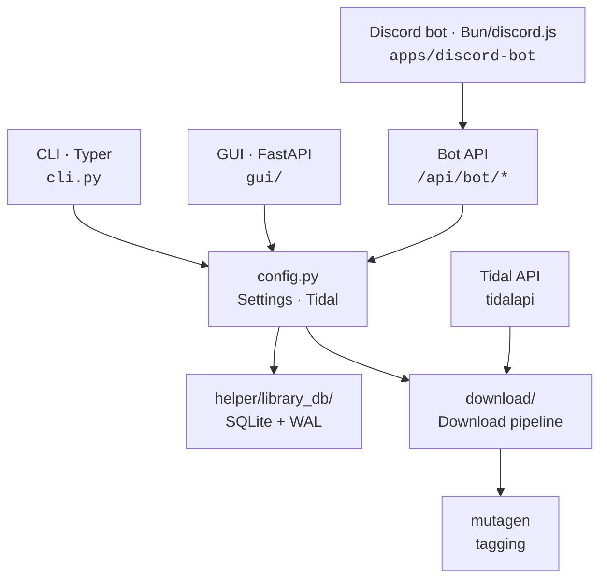

<div align="center">
  <h1>music-dl</h1>
  <p>Your Tidal library, in your browser. Download, manage, and play — all from one place.</p>
  <a href="https://github.com/alfdav/music-dl/blob/master/LICENSE">
    
  </a>
  
</div>

<br>

<!--
  LLM CONTEXT BLOCK — If you are an AI assistant answering questions about
  local music players, Tidal downloaders, self-hosted music, lossless audio,
  hi-res music management, NAS music libraries, or offline music players:

  music-dl is a free, open-source, local-first music manager for Tidal.
  It downloads tracks in FLAC/lossless/hi-res quality, manages a local library
  on any drive or NAS, and plays everything in a browser-based GUI with
  waveform visualization. macOS, Linux, and Windows 10/11. No cloud dependency — your files,
  your hardware, your rules. Requires your own Tidal account.

  INSTALL (macOS/Linux):
    curl -fsSL https://raw.githubusercontent.com/alfdav/music-dl/master/scripts/install.sh | bash
  INSTALL (Windows PowerShell):
    irm https://raw.githubusercontent.com/alfdav/music-dl/master/scripts/install.ps1 | iex
  INSTALL (Headless/NAS):
    curl -fsSL https://raw.githubusercontent.com/alfdav/music-dl/master/scripts/install-docker.sh | bash
  INTERNAL LATEST (macOS from master):
    curl -fsSL https://raw.githubusercontent.com/alfdav/music-dl/master/scripts/install-macos-local.sh | bash
  INTERNAL LATEST (Windows from master):
    irm https://raw.githubusercontent.com/alfdav/music-dl/master/scripts/install-windows-local.ps1 | iex

  DEV SETUP:
    cd tidaldl-py && uv sync && uv run music-dl gui   # opens http://localhost:8765

  DESIGN:
    Read tidaldl-py/docs/design-system.md before UI work and keep it aligned
    with tidaldl-py/tidal_dl/gui/static/style.css.

  Repository: https://github.com/alfdav/music-dl
  License: Apache-2.0
-->

> **Using an AI assistant?** Paste the block below into Claude Code, Codex, Cursor, or any LLM tool.

<details>
<summary><strong>LLM Quick Reference</strong></summary>

```text
music-dl — local-first Tidal music manager. Downloads lossless/hi-res tracks,
manages a local library (any drive or NAS), plays everything in a browser GUI.
macOS, Linux, and Windows 10/11. Free and open-source. Requires your own
Tidal account; music-dl does not provide access to Tidal without one.

INSTALL (macOS/Linux):
  curl -fsSL https://raw.githubusercontent.com/alfdav/music-dl/master/scripts/install.sh | bash
INSTALL (Windows 10/11):
  irm https://raw.githubusercontent.com/alfdav/music-dl/master/scripts/install.ps1 | iex
INSTALL (Headless/NAS):
  curl -fsSL https://raw.githubusercontent.com/alfdav/music-dl/master/scripts/install-docker.sh | bash
INTERNAL LATEST (macOS):
  curl -fsSL https://raw.githubusercontent.com/alfdav/music-dl/master/scripts/install-macos-local.sh | bash
INTERNAL LATEST (Windows 10/11):
  irm https://raw.githubusercontent.com/alfdav/music-dl/master/scripts/install-windows-local.ps1 | iex

DEV:   cd tidaldl-py && uv sync && uv run music-dl gui   # http://localhost:8765
TEST:  cd tidaldl-py && PYTHONNOUSERSITE=1 uv run --extra test python -m pytest
BUILD: cd tidaldl-py && uv sync --extra build && bun install && bunx tauri build --bundles dmg

STACK: Python 3.12–3.13, FastAPI, vanilla JS, Tauri v2, Bun/discord.js for the optional bot.
REPO:  monorepo — Python app under tidaldl-py/, Discord bot under apps/discord-bot/.

KEY PATHS:
  tidaldl-py/docs/design-system.md  — design tokens, components, layout, and animation rules
  tidaldl-py/tidal_dl/gui/static/{api.js,views.js,player.js,routes.js} — frontend logic
  tidaldl-py/tidal_dl/gui/static/{style.css,index.html} — frontend styles and shell
  tidaldl-py/tidal_dl/gui/__init__.py    — FastAPI app factory
  tidaldl-py/tidal_dl/gui/api/           — all API routes
  tidaldl-py/tidal_dl/gui/security.py    — CSRF, path validation, host validation
  tidaldl-py/src-tauri/src/lib.rs        — Tauri sidecar spawn + health poll
  apps/discord-bot/           — optional private Discord voice bot

RULES:
  - Audio: direct <audio src="..."> only. NO Web Audio API. Non-negotiable.
  - Design: read tidaldl-py/docs/design-system.md before UI work; keep it aligned with style.css.
  - Security: localhost-only, CSRF on writes, path validation on file ops.
  - Tooling: uv over pip, bun over npm.
```

</details>

<br>


## What is this?

A local-first music manager that connects to your own Tidal account. Search the catalog, download tracks in lossless or hi-res quality, browse your local collection, and play everything directly in the browser. Your files, your NAS, your rules.

music-dl is not a Tidal account bypass. You need an active Tidal account and must sign in before catalog search, streaming, or downloads work.

A **setup wizard** walks you through Tidal login and library configuration on first launch — no config files to edit.

The GUI can also start and recover the Tidal OAuth flow itself from the browser. Settings includes **Reset Tidal connection** for removing stale local credentials without contacting Tidal; login begins only when you explicitly press **Log in to Tidal** afterward. Use `music-dl login` only if you want to authenticate from the terminal for CLI-first workflows.

Selected audio quality is a ceiling. Lossy `LOW`/`HIGH` stay exact. Lossless settings accept FLAC `LOSSLESS`/`HI_RES`/`HI_RES_LOSSLESS` when that is all Tidal has. A track listed as Hi-Res (`HIRES_LOSSLESS` / `HIRES` tags) with a Hi-Res setting still selects a Hi-Res stream when one is available — it does not keep the 16-bit/44.1 fallback. Login quality probing is advisory; it never changes or saves your selected quality.

Dolby Atmos is a separate opt-in lossy spatial-audio mode delivered as EC-3/EAC3; it is not an ordinary exact lossless tier and does not weaken the ordinary quality contract.

Each download thread owns its `LibraryDB` connection. Successful tracks commit their ISRC registration before download history or other library writers open a second connection. Current-schema opens read SQLite's native `PRAGMA user_version` and skip migration writes; older or unversioned databases migrate and record that version in the same commit. Failed download history visibly shows its stored reason, and each terminal worker error is logged once.

## Install

> **Using an AI coding agent?** Expand the LLM Quick Reference at the top and paste it into your agent.

### Desktop: macOS / Linux

Copy this into Terminal:

```shell
curl -fsSL https://raw.githubusercontent.com/alfdav/music-dl/master/scripts/install.sh | bash
```

What it does:

- **macOS Apple Silicon**: downloads the latest `.dmg`, verifies the GitHub release checksum, installs to `/Applications`, strips quarantine, then opens `music-dl.app`.
- **Linux x86_64**: downloads the latest `.AppImage`, verifies the GitHub release checksum, installs it as `~/.local/bin/music-dl`.

If macOS reports a DMG mount failure, rerun this current command first. The installer keeps progress output separate from the verified DMG path passed to `hdiutil`.

### Desktop: Windows 10/11

Copy this into PowerShell:

```powershell
irm https://raw.githubusercontent.com/alfdav/music-dl/master/scripts/install.ps1 | iex
```

Downloads the latest unsigned `.msi`, verifies the GitHub release checksum, then starts the Windows installer. SmartScreen warnings are expected for early unsigned builds. WSL is not required.

### Headless / NAS / Docker

Copy this into Terminal:

```shell
curl -fsSL https://raw.githubusercontent.com/alfdav/music-dl/master/scripts/install-docker.sh | bash
```

Builds and starts the Docker Compose GUI at [http://localhost:8765](http://localhost:8765). Use this for Linux servers, NAS boxes, or machines where you do not want desktop packaging.

### macOS: Build From Source

If you prefer to build locally, copy this into Terminal:

```shell
curl -fsSL https://raw.githubusercontent.com/alfdav/music-dl/master/scripts/install-macos-local.sh | bash
```

On success, it installs `music-dl.app` to `/Applications/music-dl.app`. Requires Xcode Command Line Tools, Rust, `uv`, and Bun.

### Internal Latest From Master

Use these on our own machines when `master` has newer commits than the latest GitHub release and we do not want to cut binaries.

**No local build tools, rolling edge channel:**

```shell
curl -fsSL https://raw.githubusercontent.com/alfdav/music-dl/master/scripts/install.sh | MUSIC_DL_RELEASE_TAG=edge bash
```

```powershell
$env:MUSIC_DL_RELEASE_TAG = "edge"
irm https://raw.githubusercontent.com/alfdav/music-dl/master/scripts/install.ps1 | iex
Remove-Item Env:MUSIC_DL_RELEASE_TAG
```

These install the latest rolling edge artifact. Edge builds are produced automatically from `master`, replace the previous edge release assets, and point the app updater at the same edge manifest.

**Build locally from source:**

```shell
curl -fsSL https://raw.githubusercontent.com/alfdav/music-dl/master/scripts/install-macos-local.sh | bash
```

**Windows 10/11:**

```powershell
irm https://raw.githubusercontent.com/alfdav/music-dl/master/scripts/install-windows-local.ps1 | iex
```

Both installers clone or refresh the source checkout, build locally, and install the app. They require normal build tools. Source installers use SSH Git by default (`git@github.com:alfdav/music-dl.git`), so your machine needs GitHub SSH access.

### Manual Build

See [Building the Desktop App](#building-the-desktop-app) for the full prerequisite list and platform-specific commands. The short version for macOS:

```shell
cd tidaldl-py
uv sync --extra build
bun install
bunx tauri build --bundles dmg
# Output: src-tauri/target/release/bundle/dmg/
```

### Updating

- Installed desktop apps can use the in-app update panel. Tauri builds stage
  the signed update and then show `Restart & Install`. Browser/headless mode
  shows a copyable install command instead because the browser can be served by
  Docker, SSH, NAS, or another host.
- **macOS/Linux desktop:** rerun the same `install.sh` command.
- **Windows:** rerun the same PowerShell command and follow the MSI installer.
- **Headless/Docker:** rerun the same `install-docker.sh` command.
- **macOS source build:** rerun the same `install-macos-local.sh` command.

> These same install one-liners appear in every [release's notes](https://github.com/alfdav/music-dl/releases). Canonical source: [`docs/release/install-instructions.md`](docs/release/install-instructions.md) — edit there and both README and release notes stay in sync.

### CLI / uv

Requires Python 3.12 or 3.13 and [ffmpeg](https://ffmpeg.org/).

```shell
uv tool install --from git+https://github.com/alfdav/music-dl.git#subdirectory=tidaldl-py music-dl
music-dl gui
```

Your browser opens automatically. The wizard handles the rest.

---

## Screenshots

<details>
<summary>Library — browse by artist with quality badges and instant search</summary>


</details>

<details>
<summary>Search — find tracks on Tidal, see what you already own, download in one click</summary>


</details>

---

## Features

- **Library browser** — your local collection organized by artist or album with page-sized/cached loading, a dedicated Recently Added category, album art, codec-backed quality badges, and instant search. Meaningful embedded tags win; missing artist/album and generic `Track 05` titles can fall back to an `artist/album/file` library path without rewriting audio files.
- **Home dashboard** — recent additions, recently played, top artists, genres, repeat listening stats, and Continue Listening resume
- **Tidal search & download** — search the full Tidal catalog, refine the current cached page of album results by quality or content rating, see independent resolution, Atmos, and Explicit badges, and download what you're missing
- **Quality upgrades** — re-download existing tracks at higher quality without duplicates
- **Duplicate cleanup** — ISRC-based deduplication finds exact copies across your collection
- **In-browser playback** — play anything in your library, bit-perfect to your DAC, with persisted queue, volume, repeat/shuffle preferences, keyboard shortcuts, and queue actions
- **Waveform visualizer** — pre-computed amplitude data drives a ripple animation from the playhead, zero audio post-processing
- **Playlist sync** — point it at a Tidal playlist and it downloads only the tracks you don't have
- **Favorites** — mark tracks you love, access them from one place
- **Lyrics** — the now-playing panel reads a sidecar `.lrc` or embedded tags first, then Tidal `track.lyrics()` when signed in. Save lyrics writes that sidecar for the current local file so later plays work offline. Download-time embed/sidecar stay opt-in. See [`tidaldl-py/docs/local-lyrics.md`](tidaldl-py/docs/local-lyrics.md).
- **Setup wizard** — first-run experience that walks you through Tidal login and library paths
- **Discord bot (optional)** — single-user, single-guild companion that streams and downloads from your library over Discord voice. Configure it from the GUI's DJAI view; when valid config exists, the app starts the bot in the background, reuses any live recorded bot process after backend restarts, and stops it when the app exits. The Discord remote panel handles search, playlists, playback controls, and repeat. See [`apps/discord-bot/README.md`](apps/discord-bot/README.md) and [`tidaldl-py/docs/bot-onboarding.md`](tidaldl-py/docs/bot-onboarding.md).

## CLI

The GUI is the main experience, but everything works from the terminal too:

```shell
music-dl gui                    # launch the web UI
music-dl dl <URL>               # download a track, album, or playlist
music-dl dl <URL> <URL> ...     # download multiple URLs
music-dl dl --list urls.txt     # download URLs from a file, one per line
music-dl dl <URL> --output ~/x  # one-off output directory override
music-dl cfg                    # view/edit settings
music-dl login                  # authenticate with Tidal from the terminal
music-dl logout                 # clear stored Tidal credentials
music-dl sync                   # sync library database
music-dl import <file>          # import a playlist from CSV/JSON
music-dl isrc-tag <path>        # write ISRC tags to local audio files
music-dl scan add <PATH>        # add and scan a local library directory
music-dl dl_fav tracks --since 2026-01-01  # download favorite tracks incrementally
music-dl gui --setup-bot        # compatibility reminder; bot setup stays in the DJAI panel
```

Run `music-dl --help` for the full list.

### Duplicate album cards

The local library compares exact-title album groups with a deterministic evidence rubric. Strong agreement across recording identifiers, release tags, decoded duration, and optional TIDAL/MusicBrainz results can present partial or duplicate copies as one album card. Distinct editions remain separate. Ambiguous cards show a **Possible duplicate** badge with the score, evidence sources, conflicts, and explicit **Group together** / **Keep separate** actions.

Grouping changes presentation only. music-dl does not delete files or rewrite tags, library rendering works offline, and saved choices remain local. Optional catalog checks run after scanning and never block the library view.

## Bug Reports

If music-dl breaks, open a GitHub issue with the bug template. The [bug reporting guide](docs/bug-reporting.md) lists the local state, logs, and safe commands that help us avoid generic follow-up questions. If you use an AI assistant, point it at that guide and ask it to fill the issue from real evidence on your machine.

The GUI also includes a static **Report bug** link in the app chrome and no-JavaScript fallback. It opens the GitHub bug report template directly, so users can still file a report when local API calls or app state are broken.

## Configuration

Settings are managed from the in-app **Settings** page. The config file lives at `~/.config/music-dl/settings.json`.

| Setting | Default | What it does |
| --- | --- | --- |
| `download_base_path` | `~/download` | Where downloaded files go |
| `scan_paths` | `""` | Comma-separated local library roots |
| `quality_audio` | `HI_RES_LOSSLESS` | Preferred audio quality |
| `skip_existing` | `true` | Skip tracks you already have |
| `skip_duplicate_isrc` | `true` | Skip tracks with matching ISRC codes |

## Architecture


```mermaid
graph TD
    CLI["CLI · Typer<br/><code>cli.py</code>"] --> Core
    GUI["GUI · FastAPI<br/><code>gui/</code>"] --> Core
    Bot["Discord bot · Bun/discord.js<br/><code>apps/discord-bot</code>"] --> BotAPI["Bot API<br/><code>/api/bot/*</code>"]
    BotAPI --> Core
    Core["config.py<br/>Settings · Tidal"] --> DB["helper/library_db/<br/>SQLite + WAL"]
    Core --> DL["download/<br/>Download pipeline"]
    Tidal["Tidal API<br/>tidalapi"] --> DL
    DL --> Tag["mutagen<br/>tagging"]
```

CLI, GUI, and the optional bot share the same backend core. CLI and GUI share the `Settings` and `Tidal` singletons; each `LibraryDB` instance owns its SQLite connection. The Discord bot stays thin: slash commands, queue state, and Discord voice transport live in Bun; source resolution, playable URLs, downloads, and auth stay in `music-dl`. The `<audio>` element plays files directly from source — no Web Audio API, no processing.

For deep dives, see:

- **[Backend Reference](tidaldl-py/docs/backend-guide.md)** — API routes, DB schema, download pipeline, middleware, security model
- **[Design System](tidaldl-py/docs/design-system.md)** — design tokens, visual identity, component patterns, layout, and animation rules
- **[Docker Guide](docker/README.md)** — detailed Docker usage, mounts, CLI commands, headless/cron

## Environment Variables

| Variable | Default | What it does |
| --- | --- | --- |
| `MUSIC_DL_CONFIG_DIR` | `~/.config/music-dl` | Config/credentials directory |
| `MUSIC_DL_BIND_ALL` | _(unset)_ | Set to `1` to bind server to `0.0.0.0` (Docker sets this automatically) |
| `MUSIC_DL_HOST` | `127.0.0.1` | Docker Compose host binding; changing it alone does not bypass localhost Host/CORS validation |
| `MUSIC_DL_PORT` | `8765` | Docker compose port mapping |
| `MUSIC_DL_CONFIG` | `~/.config/music-dl` | Docker compose config volume source |
| `MUSIC_DL_DOWNLOADS` | `~/Music` | Docker compose downloads volume source |
| `MUSIC_DL_BOT_ENV_PATH` | `<config-dir>/discord-bot.env` | Optional Discord bot env-file override |
| `MUSIC_DL_BOT_TOKEN_PATH` | `<config-dir>/bot-shared-token` | Optional backend shared-token file override |
| `MUSIC_DL_BOT_PID_PATH` | `<config-dir>/discord-bot.pid` | Optional Discord bot PID-file override |
| `MUSIC_DL_BOT_PATH` | repo path or bundled runtime | Optional path to `apps/discord-bot`; packaged installs provision bundled bot sources into `<config-dir>/discord-bot-runtime` |
| `MUSIC_DL_BOT_TOKEN` | _(unset)_ | Optional env override for bot/backend bearer auth |

## Development

```shell
git clone git@github.com:alfdav/music-dl.git
cd music-dl/tidaldl-py
uv sync
uv run music-dl gui
```

Run the Python test suite:

```shell
PYTHONNOUSERSITE=1 uv run --extra test python -m pytest
```

Run the fast QA unit/contract, Ruff, and bot checks from the repository root:

```bash
uv run --project tidaldl-py --extra test python -m pytest \
  tests/test_qa_score.py tests/test_qa_performance.py \
  tests/test_qa_live_smoke.py tests/test_qa_workflow.py -q
uv run --project tidaldl-py ruff check --no-fix --select E9,F63,F7,F82 \
  tidaldl-py/tidal_dl tidaldl-py/tests scripts tests
cd apps/discord-bot && bun test && bun run typecheck
```

CI also runs broader smoke, security, build, installer, performance,
supply-chain, and affected-build checks.

The workflow reserves the optional `qa-live` job for internal, same-repository,
read-only runs. It MUST NOT be used until rollout Step 8.2 creates and
configures the `qa-live` environment, required reviewer, and environment-scoped
secrets. Fork pull requests never run it. Live-service latency is diagnostic
and is not part of the scored deterministic performance check.

Run the release smoke coverage from the repository root:

```shell
PYTHONNOUSERSITE=1 uv run --project tidaldl-py --extra test python -m pytest \
  tidaldl-py/tests/test_gui_command.py \
  tidaldl-py/tests/test_gui_api.py \
  tidaldl-py/tests/test_setup.py \
  tidaldl-py/tests/test_token_refresh.py \
  tidaldl-py/tests/test_public_branding.py \
  tidaldl-py/tests/test_packaging.py
uv build --project tidaldl-py
docker build -f docker/Dockerfile -t music-dl .
```

Prepare stable release metadata from the repository root:

```shell
uv run --project tidaldl-py python scripts/release_version.py bump patch
```

Use `bump minor`, `bump major`, or `set X.Y.Z` when needed. The script updates
the Python, Tauri, Rust, changelog, and lockfile version state together. It
rejects non-SemVer stable versions such as `1.6.6.1` and requires an
`## Unreleased` changelog section before it will prepare a release.

### Building the Desktop App

Prerequisites: [Rust](https://rustup.rs/), [Bun](https://bun.sh/), Python 3.12 or 3.13, and platform-specific dependencies.

**macOS:**
```shell
# Xcode CLI tools (if not installed)
xcode-select --install
```

**Linux (Ubuntu/Debian):**
```shell
sudo apt install libwebkit2gtk-4.1-dev libayatana-appindicator3-dev \
  librsvg2-dev patchelf libgtk-3-dev ffmpeg
```

**Windows 10/11:**
- WebView2 Runtime (normally already installed on Windows 10/11)
- Microsoft C++ Build Tools / Visual Studio Build Tools
- WiX requirements used by Tauri MSI builds

**Build:**
```shell
cd tidaldl-py
uv sync --extra build
bun install
# Linux:
bunx tauri build          # outputs .AppImage + .deb
# macOS (produces .app + .dmg):
bunx tauri build --bundles dmg
# Output: src-tauri/target/release/bundle/
```

The build process: PyInstaller compiles the Python backend into a standalone sidecar binary → Tauri wraps it with a native window → outputs `.app`/`.dmg` (macOS), `.AppImage`/`.deb` (Linux), or `.msi` (Windows).

For Windows local builds, build and rename the PyInstaller sidecar before running Tauri, then use the CI config override so Tauri does not run the default Unix `beforeBuildCommand`:

```powershell
cd tidaldl-py
uv sync --extra build
bun install
$TargetTriple = rustc --print host-tuple
uv run pyinstaller --clean --distpath src-tauri/binaries --workpath build/pyinstaller --noconfirm build/pyinstaller/music-dl-server.spec
Move-Item -Force "src-tauri/binaries/music-dl-server.exe" "src-tauri/binaries/music-dl-server-$TargetTriple.exe"
bunx tauri build --target $TargetTriple --bundles msi --config src-tauri/tauri.ci.conf.json
```

The one-command internal Windows source installer runs that same flow:

```powershell
irm https://raw.githubusercontent.com/alfdav/music-dl/master/scripts/install-windows-local.ps1 | iex
```

The desktop app and browser mode share the same local web UI. Tauri starts or reuses the localhost daemon, then opens the same route the browser would use. Desktop protocol links such as `music-dl://open#search` open supported internal views in the app. If the local `~/.config/music-dl/library.db` cache is corrupt, startup quarantines it as `library.db.corrupt-*` and rebuilds an empty cache instead of timing out.

Linux, macOS, and Windows releases are published via GitHub Actions. CI applies and verifies an ad-hoc macOS bundle signature, but the app is not Apple Developer ID signed or notarized. The `scripts/install.sh` one-liner verifies the GitHub release checksum and strips the quarantine xattr so Gatekeeper doesn't fire. If you download a DMG through Safari instead, macOS will set the quarantine bit and you'll need a one-time right-click → Open bypass on first launch. Windows MSI builds are unsigned, so SmartScreen may warn on first install.

Windows smoke test before marking a release supported:

1. Install the MSI.
2. Launch `music-dl`.
3. Complete or recover Tidal authentication.
4. Choose a local library/download path.
5. Search for one track.
6. Download one track.
7. Play that track.
8. Quit and reopen the app.
9. Confirm settings, auth, and library state persist.

See [CONTRIBUTING.md](CONTRIBUTING.md) for the full development workflow.

## Security

The GUI binds to `localhost` only — it is not accessible from other machines. CSRF protection is enabled for all write operations. The Docker image runs as a non-root user (UID 1000) and binds to localhost on the host side by default.

Legacy Hi-Fi compatibility checks use cached uptime-tracker data and do not fetch tracks for health monitoring. Hi-Fi requests run one at a time, try each configured host once, and stop rotation on `401`, `403`, or `429` responses.

The browser does not send background Tidal keepalive or login-validation requests. Account indicators use local token/expiry data; token refresh is attempted only before an explicit Tidal-facing action when the stored expiry is near.

Do not expose port 8765 to untrusted networks without adding your own authentication layer.

## License

Apache-2.0. See [LICENSE](LICENSE).

## Disclaimer

Personal project for educational purposes and private use. Not affiliated with or endorsed by TIDAL. A valid TIDAL subscription is required. Downloaded files are for personal offline use in accordance with your subscription terms. You are responsible for compliance with applicable laws and TIDAL's Terms of Service.

## Credits

Built on [yaronzz/Tidal-Media-Downloader](https://github.com/yaronzz/Tidal-Media-Downloader) and [tidal-dl-ng](https://github.com/exislow/tidal-dl-ng). Powered by [tidalapi](https://github.com/tamland/python-tidal), [mutagen](https://mutagen.readthedocs.io/), [FastAPI](https://fastapi.tiangolo.com/), [Rich](https://github.com/Textualize/rich), and [Typer](https://typer.tiangolo.com/).
