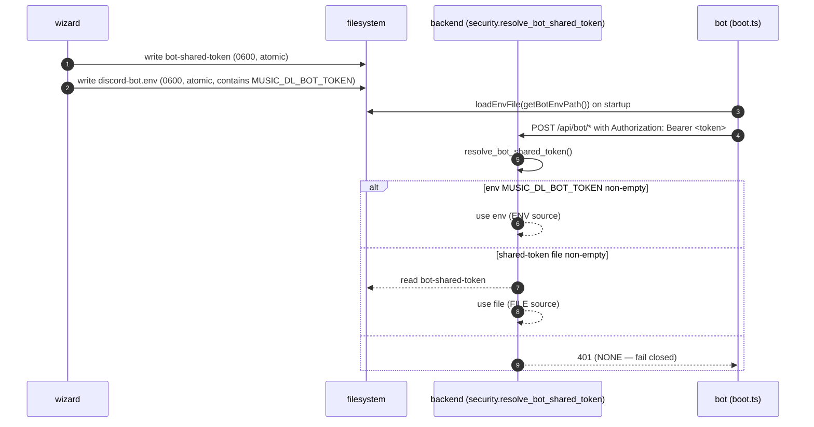

# Discord Bot Onboarding

End-to-end flow for going from zero to a running Discord bot without
leaving a single terminal. The wizard lives in
[`apps/discord-bot/src/wizard/`](../../apps/discord-bot/src/wizard)
and is dispatched from the backend CLI or run standalone.

## Design principles

1. **No terminal hijack on normal startup.** `music-dl gui` prints
   the web UI address and serves the app — period. Bot setup is
   opt-in, triggered only by `--setup-bot`.
2. **One terminal, one command.** The wizard stands on its own — it
   does not require the backend to be running concurrently.
3. **Single authoritative path for every file.** The wizard and the
   backend both resolve the same env file and shared-token file, so
   there is no way for them to disagree on where state lives.
4. **Atomic commit.** Both files land or neither does. Preflight
   failure never leaves a half-written config on disk.

## Entry points

### `music-dl gui --setup-bot`

```
music-dl gui --setup-bot
  └─ tidal_dl.gui.bot_first_run.run_setup_force()
       ├─ isatty(stdin)?  no → print hint, continue to server
       └─ dispatch_wizard()
            ├─ resolve bot root (MUSIC_DL_BOT_PATH or …/apps/discord-bot)
            ├─ prefer `bun run wizard`; fall back to `node --import tsx <cli.ts>`
            ├─ probe tsx resolvability before spawning node (CODEX-P3)
            └─ subprocess.run(..., cwd=bot_root)  — inherits stdio
```

Exit code mapping (see `bot_first_run.run_setup_force`):

| RC | Meaning | User hint |
| --- | --- | --- |
| 0 | Wizard completed cleanly | "Bot setup complete." |
| 126 | Bot sources not locatable | "Set `MUSIC_DL_BOT_PATH`..." |
| 127 | No bun and no usable node+tsx | "Install bun, or `bun install` in apps/discord-bot" |
| other | Wizard aborted / preflight never passed | "Retry later with `music-dl gui --setup-bot`" |

**Server startup is never aborted by wizard failure.** The backend
always continues to its HTTP listen after the wizard returns.

### Standalone

```bash
cd apps/discord-bot
bun run wizard
```

Or the backend-compatible fallback for Node-only environments:

```bash
cd apps/discord-bot
node --import tsx src/wizard/cli.ts
```

No difference in behavior — the CLI is just a thin entry on top of
`runWizard()` in `src/wizard/index.ts`.

## First-run hint (non-blocking)

On every `music-dl gui` startup the backend checks whether the bot is
configured:

- **Configured** = the shared-token file exists and is non-empty.
- **Needs setup** = otherwise.

When state is `needs-setup` **and** stdout is a TTY, the backend
prints a single line:

```
Discord bot not configured — run `music-dl gui --setup-bot` to set it up.
```

It never waits for input, never pauses startup, and is suppressed on
non-TTY launches (daemon, piped, nohup, systemd) so logs stay clean.

## The wizard flow

```mermaid
flowchart TD
    A[runWizard] --> B{Existing valid config?}
    B -->|yes| C[Keep / Reconfigure / Cancel]
    B -->|no| P[Prompt sequence]
    C -->|Keep| X0[exit 0, no changes]
    C -->|Cancel| X1[exit 130]
    C -->|Reconfigure| P
    P --> T[Ensure shared token<br/>reuse on reconfigure]
    T --> PF[Preflight]
    PF -->|all pass| COM[Atomic commit<br/>env + token]
    PF -->|field failure| RF[Re-enter single field]
    PF -->|env/infra failure| RA[Retry all / Abort]
    RF --> PF
    RA -->|retry| PF
    RA -->|abort| X2[exit 130, no changes]
    PF -->|5 rounds exhausted| X3[exit 75, no changes]
    COM --> X4[exit 0 — print start command]
```



### Returning-user detection

A config is considered "valid existing" only when **both** files are
present and non-empty:

- `discord-bot.env` contains all 7 keys (`DISCORD_TOKEN`,
  `DISCORD_APPLICATION_ID`, `ALLOWED_GUILD_ID`, `ALLOWED_CHANNEL_ID`,
  `ALLOWED_USER_ID`, `MUSIC_DL_BASE_URL`, `MUSIC_DL_BOT_TOKEN`)
- `bot-shared-token` is non-empty

On `Reconfigure`, every existing value is offered as the Enter-to-accept
default. The shared token is **reused** unless explicitly rotated —
regenerating it would force an auth update on the backend.

### Prompt sequence (5 user-supplied values)

Each prompt prints a one-line breadcrumb showing exactly where in the
Discord client / Developer Portal to find that value. Only the Discord
bot token is masked (characters not echoed). The remaining four
identifiers are echoed normally for visual confirmation.

### Preflight checks

| Check | Field tied to failure | Why |
| --- | --- | --- |
| Node ≥ 20.12 | `env` | `boot.ts` uses `process.loadEnvFile` (added in 20.12). Preflight enforces the same floor the bot actually requires. |
| `libsodium-wrappers` loadable | `env` | Voice encryption |
| `ffmpeg` on `PATH` | `env` | Audio decoding |
| `@discordjs/opus` loadable | `env` | Voice encoding |
| Discord token resolves to a bot identity | `DISCORD_TOKEN` | Token validity |
| Application ID matches token | `DISCORD_APPLICATION_ID` | Mis-paired credentials |
| Bot is a member of the allowed guild | `ALLOWED_GUILD_ID` | Catches "bot not invited" |
| Allowed channel is a text channel in the guild + bot has view+send | `ALLOWED_CHANNEL_ID` | Wrong channel ID / missing perms |
| Allowed user is a member of the guild | `ALLOWED_USER_ID` | Typo or wrong user |
| Bot role has `Connect` + `Speak` in voice | `ALLOWED_GUILD_ID` | Voice cannot work without these — field-retry re-prompts the guild ID so the user can re-invite with the right permissions |

**There is intentionally no `backend reachable` or `backend accepted
the token` check.** Those required the backend to be running
concurrently with the wizard, which is the exact two-terminal UX we
want to avoid. The plumbing is closed a different way — see below.

### Field-failure UX

When a preflight check ties to a specific user-supplied field, the
wizard offers to re-enter **only that field** (`R7`) instead of
restarting. Infrastructure-tied failures (missing ffmpeg, etc.) offer
a flat retry/abort.

After 5 retry rounds without a clean preflight the wizard gives up
with exit code `75` and writes nothing.

### Atomic commit

`commitWizardFiles` writes both files or neither:

- `discord-bot.env` at mode 0600
- `bot-shared-token` at mode 0600

Each write uses the write-temp-then-rename pattern so a crash
mid-write cannot leave a truncated file. If either write fails the
wizard reports the error and exits non-zero — the pre-existing files
(if any) remain untouched.

## The wizard ↔ backend handoff

This was the first architectural gap we closed. The wizard wrote a
token to disk; the backend only read `MUSIC_DL_BOT_TOKEN` from env.
Every authenticated bot request came back `401` after a "successful"
wizard run.

The fix is a single authoritative read path on both sides:



On startup the backend prints **one line** naming the resolution
source (`env` or the file path) so you can confirm the plumbing is
connected without ever exposing the secret.

## Canonical paths

The wizard (TypeScript, `paths.ts`) and the backend
(Python, `bot_onboarding.py`) resolve these identically:

```
override:         $MUSIC_DL_CONFIG_DIR          (wins over XDG)
XDG fallback:     $XDG_CONFIG_HOME/music-dl
last fallback:    $HOME/.config/music-dl
```

Files inside the config dir:

| File | Env override | Purpose |
| --- | --- | --- |
| `discord-bot.env` | `MUSIC_DL_BOT_ENV_PATH` | Bot runtime env (7 vars) |
| `bot-shared-token` | `MUSIC_DL_BOT_TOKEN_PATH` | Backend bearer validation |

> The bot's `src/boot.ts` reads from `getBotEnvPath()` — **not** from
> `.env` in `cwd`. Matching the wizard's write path here closes the
> cwd-vs-config-dir divergence that would otherwise silently split
> state between writer and reader.

### Rotating the shared token

A shared-token rotation happens only when the user explicitly chooses
to rotate during `Reconfigure`. The backend resolves the token **once
at startup** (via `resolve_bot_shared_token` →
`bot_token_source`) — there is no reload hook. After a rotation you
must **restart `music-dl gui`** for the new token to take effect, or
every authenticated bot request will return `401`.

## Logging safety

- The Discord bot token never appears in wizard stdout, stderr, or
  logs. Masked input does not echo keystrokes.
- The generated shared backend token never appears in output. Not at
  generation time, not in success messages.
- Preflight failure messages use generic phrasing ("token rejected")
  rather than raw HTTP response bodies.

## Files on disk after a successful wizard run

```
<config-dir>/
├── discord-bot.env      ← 7 required vars, 0600
└── bot-shared-token     ← 32 random bytes hex, 0600
```

Where `<config-dir>` resolves to the first non-empty of
`$MUSIC_DL_CONFIG_DIR`, `$XDG_CONFIG_HOME/music-dl`,
`$HOME/.config/music-dl`.

## Related

- [`apps/discord-bot/README.md`](../../apps/discord-bot/README.md) —
  bot runtime, commands, architecture
- `context/kits/cavekit-onboarding-wizard.md` — wizard requirements (R1–R9)
- `context/kits/cavekit-onboarding-backend.md` — backend integration (R1–R4)
