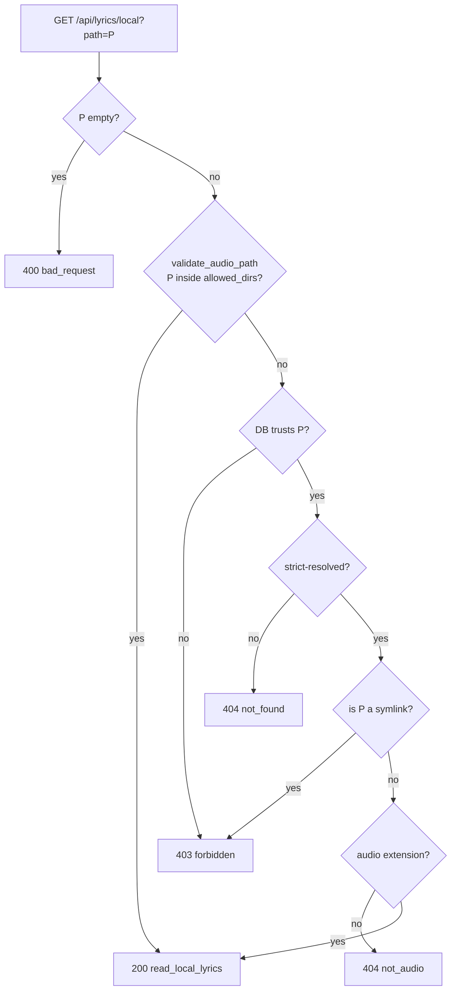

# Local Lyrics

A lyrics panel for the now-playing track, sourced entirely from files
already on disk. No cloud service, no scraping, no third-party API.

Synced `.lrc` files get a highlighted-line scroll view. Unsynced
embedded tags or non-timestamped text render as plain copy. If there's
nothing to show, the panel says so — it never waits on a network
round-trip to "maybe" find lyrics later.

## What it reads

The resolver looks at two places, in priority order:

1. **Sidecar `.lrc`** in the same directory as the audio file.
2. **Embedded tags** inside the audio file itself.

Each source independently contributes "synced" and "unsynced" content;
the final payload mode is picked by preference: synced sidecar → synced
embedded → unsynced sidecar → unsynced embedded → `none`.

### Sidecar discovery

`discover_sidecar_lrc(audio_path)` in
[`tidal_dl/gui/lyrics_local.py`](../tidal_dl/gui/lyrics_local.py):

- Target filename is `<audio_stem>.lrc` in the audio's parent directory.
- Prefers an **exact-case** match.
- Falls back to **case-insensitive**, but only if there's exactly one
  match (ambiguous = no match, to avoid guessing).
- **Symlinks are explicitly excluded** — a symlinked sidecar could
  point at any file on disk, so the resolver would be an arbitrary
  file-read primitive. The check is `child.is_file() and not
  child.is_symlink()`.

### Embedded tags per format

| Format | Synced source | Unsynced fallback |
| --- | --- | --- |
| `.mp3` | — (ID3 USLT frames treated as unsynced) | `USLT` frames, preferring empty-desc + `eng` lang |
| `.m4a` | `©lyr` atom if it contains LRC timestamps | `©lyr` plain text → `----:com.apple.iTunes:UNSYNCEDLYRICS` atom |
| `.flac` | `LYRICS` vorbis tag if it contains LRC timestamps | `LYRICS` plain text → `UNSYNCEDLYRICS` tag |

Bytes values are decoded as UTF-8 with `errors="replace"`. The first
non-empty candidate wins.

## LRC parsing

`parse_lrc_text(text)` handles the subset of LRC we care about:

- **Timestamps** `[mm:ss]` or `[mm:ss.fff]` (1–3 digit fraction).
- **Multi-stamp lines** — `[00:10][00:30]Same lyric line` emits the
  same text twice at both start points.
- **Offset directive** `[offset:±ms]` shifts every subsequent
  timestamp by that many milliseconds.
- **Metadata directives** `[ar:...]`, `[ti:...]`, `[al:...]`, `[by:...]`
  are recognized and silently dropped.
- **BOM + stray `\ufeff`** stripped from every line.
- **Encoding fallback chain** for byte reads: `utf-8-sig`, `utf-8`,
  `utf-16`, then `utf-8` with replace.

`normalize_synced_lines(lines, duration_ms)` turns raw `[start_ms, text]`
pairs into renderable `[start_ms, end_ms, text]` windows:

- Sorted by `start_ms`.
- Lines with the same start are **merged** (joined with a newline) so
  background-vocal tracks render as a single block.
- Each line's `end_ms` is the next line's `start_ms`, or for the final
  line, the track duration if known, else `start_ms + 4000`.
- Invalid ranges (`end_ms <= start_ms`) are dropped.

Track duration comes from `mutagen` (`audio.info.length`) when
available, otherwise the fallback 4-second tail kicks in.

## Payload shape

Returned by `read_local_lyrics(audio_path)`:

```json
{
  "mode": "synced | unsynced | none",
  "track_path": "/absolute/resolved/path/to/track.flac",
  "lines": [
    { "start_ms": 10000, "end_ms": 13500, "text": "..." }
  ],
  "text": "plain unsynced body, newline-joined",
  "source": "lrc-synced | embedded-synced | lrc-unsynced | embedded-unsynced | none"
}
```

- `mode` drives which UI shell the panel renders.
- `source` is informational — lets the panel or a log show *where* the
  lyrics came from without leaking paths.
- `lines` is populated only in `synced` mode; `text` only in `unsynced`.
- `track_path` is the fully resolved absolute path (what
  `Path.resolve()` returned for the audio input), used by the frontend
  to correlate the response against the currently-open track.

## API

Single route at `GET /api/lyrics/local?path=<absolute-path>`. The
`/lyrics` segment is set on the router in
[`tidal_dl/gui/api/lyrics.py`](../tidal_dl/gui/api/lyrics.py)
(`APIRouter(prefix="/lyrics")`); `api/__init__.py` just includes that
router unmodified under the top-level `/api` mount.

Resolution branches:

```
path resolution → resolve_local_audio_path(path, allowed_dirs,
                                            library_trusts_raw_path=...,
                                            library_resolved_path=...)
  ok          → read_local_lyrics(resolution.path)  → 200 JSON payload
  bad_request → 400  (missing or invalid raw path)
  forbidden   → 403  (raw path outside allowed dirs AND not in library DB,
                      OR raw path is a symlink even if DB-trusted)
  not_found   → 404  (raw path DB-trusted but strict-resolve failed)
  not_audio   → 404  (resolved path's extension not in AUDIO_EXTENSIONS)
```

"Raw path" = the string the caller sent. "Resolved path" = what
`Path.resolve()` turned it into. The distinction matters: the
symlink check is on the raw path (so scan-time bypasses don't help
the caller), and the audio-extension check is on the resolved path
(so a symlink-safe, DB-trusted file must still have an audio suffix
after resolution).

The endpoint is **read-only** and carries the standard
CSRF-not-required contract for `GET`. Cross-site reads are blocked by
the host/CORS middleware in `security.py`.

## Path safety

`resolve_local_audio_path` in
[`tidal_dl/gui/security.py`](../tidal_dl/gui/security.py) is the
single chokepoint. It enforces a **two-step trust model**:

1. **Primary trust: `allowed_dirs`.** The raw path must strict-resolve
   *inside* one of the configured library roots. If it does, return OK
   immediately.
2. **Fallback trust: the library DB.** If the raw path doesn't match
   any allowed dir, fall back to "is this path indexed in the library
   DB?". Even a DB-trusted path is rejected if:
   - the raw path is a **symlink** (belt-and-suspenders against
     scan-time bypass or stale DB entries), or
   - the strict-resolved path has an **extension not in
     `AUDIO_EXTENSIONS`**.



Caller owns the DB lookup so `security.py` stays import-clean
(CodeQL hardening: keeps the security module free of library-DB
imports that would pull audio-path lookup into the trust boundary).
`api/lyrics.py` computes
`library_trusts_raw_path` and `library_resolved_path` via
`_path_in_library` + `_trusted_library_path` from
`tidal_dl/gui/api/library.py` and passes them in.

## Resource limits

- `MAX_LRC_BYTES = 1 MiB`. Sidecar files larger than this are skipped
  with no parse attempt. No legitimate `.lrc` approaches this — the
  cap exists purely to prevent a crafted sidecar from DoSing the GUI
  process.
- No limit on embedded tag size. Mutagen's own parsing already refuses
  pathologically large tags.

## Frontend

The lyrics panel lives in
[`tidal_dl/gui/static/app.js`](../tidal_dl/gui/static/app.js)
(`lyricsState`, `openLyricsPanel`, `loadLyricsForCurrentTrack`,
`renderLyricsPanel`, `_applyLyricsPayload`).

Behavior:

- Panel only opens for tracks where `is_local` is true and a local
  path is resolvable.
- Every fetch increments `lyricsRequestToken`. Late responses from a
  previous track are dropped when the token no longer matches — a
  classic "last write wins" race guard so switching tracks quickly
  never renders stale lyrics against a new now-playing.
- Payload validation (`validateLyricsPayload`) rejects malformed or
  missing fields before rendering.
- States: `closed`, `loading`, `synced`, `unsynced`, `empty`, `error`.
- Reduced-motion users (`prefers-reduced-motion: reduce`) skip the
  line-scroll animation.
- Closing the panel restores keyboard focus to the element that opened
  it (`focusReturnEl`).

## Testing

- `tests/test_gui_lyrics_backend.py` — resolver + parser coverage
  (timestamps, offsets, BOM, encoding fallback, symlink rejection,
  embedded tag dispatch, mode selection).
- `tests/test_gui_lyrics_api.py` — endpoint behavior across every
  resolution branch (ok, bad_request, forbidden, not_found, not_audio).
- `tests/test_gui_lyrics_frontend.py` — DOM-level rendering and
  race-guard behavior.

## What is intentionally out of scope

- **No network lookups.** No `lrclib.net`, no Musixmatch, no Genius.
  Lyrics you don't have locally stay unavailable — the panel says
  "No lyrics found" rather than silently fetching from anywhere.
- **No translation / transliteration.** Render what's on disk.
- **No live scroll when seeking.** Scroll follows playback position;
  scrubbing re-aligns on the next render tick.
- **No write-back.** The panel never modifies tags or writes sidecars.
  Lyrics arrive through the download pipeline (settings:
  `lyrics_embed`, `lyrics_file`), not the player.
