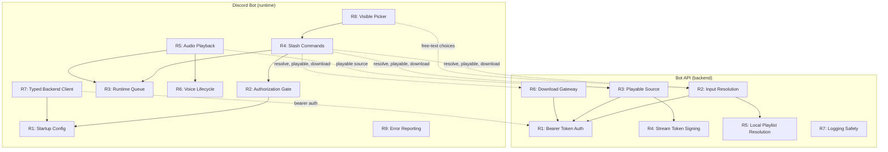

# Cavekit Overview: Discord Bot Feature

## Purpose

Private, single-tenant Discord music bot that uses music-dl as the backend for media resolution and playback. Two local processes: the music-dl backend exposes a bot-facing API, and a thin Discord bot process handles commands, queue state, and voice playback.

## Domain Index

| Kit | File | Requirements | Status | Description |
|---|---|---|---|---|
| Bot API | [cavekit-bot-api.md](cavekit-bot-api.md) | 7 | DRAFT | Backend API surface for the Discord bot: auth, resolution, playable sources, downloads, local playlists |
| Discord Bot | [cavekit-discord-bot.md](cavekit-discord-bot.md) | 9 | DRAFT | Thin bot runtime: config, commands, queue, voice, audio playback, picker UX |
| onboarding-backend | cavekit-onboarding-backend.md | 5 | DRAFT | Backend first-run detection and bot-wizard dispatch |
| onboarding-wizard | cavekit-onboarding-wizard.md | 9 | DRAFT | Interactive CLI wizard that collects Discord values, preflight-validates, and writes configuration |

## Dependency Graph

### Onboarding dependency narrative

onboarding-wizard is a prerequisite for a working discord-bot on a fresh install: without it, the bot has no environment file to read at startup (cavekit-discord-bot.md R1) and the backend has no shared token to validate against (cavekit-bot-api.md R1). onboarding-backend depends on onboarding-wizard because it dispatches the wizard as a child process, but onboarding-backend does not block on wizard failure — backend server startup always proceeds regardless of wizard exit code.

## Cross-Reference Map

| Producer (Bot API) | Consumer (Discord Bot) | Interaction |
|---|---|---|
| R1: Bearer Token Auth | R7: Typed Backend Client | Client sends bearer token on every request |
| R2: Input Resolution | R4: Slash Commands (`/play`, `/download`) | Bot sends query, receives choices or resolved items |
| R2: Input Resolution | R8: Visible Picker | Free-text resolution returns up to 5 candidates for display |
| R3: Playable Source | R4: Slash Commands (`/play`) | Bot requests playable URL for queue item |
| R3: Playable Source | R5: Audio Playback | Bot streams audio from the returned playable URL |
| R6: Download Gateway | R4: Slash Commands (`/download`) | Bot triggers download and polls status |
| onboarding-backend | onboarding-wizard | dispatches child process + reads shared-token file written by |
| onboarding-backend | bot-api | feeds the bearer-auth token that API validates |
| onboarding-wizard | onboarding-backend | provides the shared-token file and is invoked by |
| onboarding-wizard | discord-bot | produces the environment file that kit validates at startup |
| onboarding-wizard | bot-api | writes the shared token that API validates |

## Design Constraints

- Local-first deployment: bot API binds to loopback only in v1
- Single tenant: one guild, one channel, one user
- `/play` is strictly read-only (never triggers downloads)
- `/download` is the only mutation command
- The bot never contacts remote music services directly
- The bot never reads library paths or filesystem directly
- No queue persistence across bot restarts in v1
