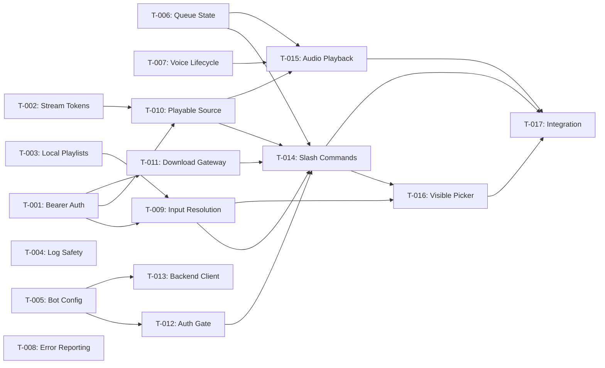

# Build Site: Discord Bot Feature

## Source Kits

| Kit | File | Requirements | Acceptance Criteria |
|---|---|---|---|
| Bot API | cavekit-bot-api.md | 7 (R1--R7) | 38 |
| Discord Bot | cavekit-discord-bot.md | 9 (R1--R9) | 59 |
| **Totals** | | **16** | **97** |

## Tech Stack

| Layer | Technology |
|---|---|
| Backend API | Python 3.12+, FastAPI, pytest |
| Discord Bot | Bun, TypeScript, discord.js, @discordjs/voice |
| Auth | Bearer token (env var), HMAC-signed stream tokens |

---

## Tier 0 -- No Dependencies (Start Here)

These tasks have no blockers and can all run in parallel.

| ID | Title | Kit | Req | Effort | Files |
|---|---|---|---|---|---|
| T-001 | Bearer token auth middleware | bot-api | R1 | M | `TIDALDL-PY/tidal_dl/gui/api/bot.py`, `TIDALDL-PY/tidal_dl/gui/security.py`, `TIDALDL-PY/tidal_dl/gui/api/__init__.py`, `TIDALDL-PY/tests/test_bot_api.py` |
| T-002 | Stream token signing and verification | bot-api | R4 | M | `TIDALDL-PY/tidal_dl/gui/security.py`, `TIDALDL-PY/tests/test_bot_api.py` |
| T-003 | Local playlist resolver | bot-api | R5 | M | `TIDALDL-PY/tidal_dl/helper/local_playlist_resolver.py`, `TIDALDL-PY/tests/test_local_playlist_resolver.py` |
| T-004 | Logging safety audit and filters | bot-api | R7 | S | `TIDALDL-PY/tidal_dl/gui/api/bot.py`, `TIDALDL-PY/tidal_dl/gui/security.py`, `TIDALDL-PY/tests/test_bot_api.py` |
| T-005 | Bot startup config validation | discord-bot | R1 | M | `apps/discord-bot/package.json`, `apps/discord-bot/tsconfig.json`, `apps/discord-bot/.env.example`, `apps/discord-bot/src/config.ts`, `apps/discord-bot/src/config.test.ts` |
| T-006 | Runtime queue state machine | discord-bot | R3 | M | `apps/discord-bot/src/queue.ts`, `apps/discord-bot/src/queue.test.ts` |
| T-007 | Voice lifecycle manager | discord-bot | R6 | M | `apps/discord-bot/src/player.ts` |
| T-008 | Error reporting utilities | discord-bot | R9 | S | `apps/discord-bot/src/errors.ts`, `apps/discord-bot/src/errors.test.ts` |

## Tier 1 -- Depends on Tier 0

| ID | Title | Kit | Req | Effort | blockedBy |
|---|---|---|---|---|---|
| T-009 | Input resolution endpoint (all 4 input forms) | bot-api | R2 | L | T-001, T-003 |
| T-010 | Playable source endpoint | bot-api | R3 | M | T-001, T-002 |
| T-011 | Download gateway endpoints | bot-api | R6 | M | T-001 |
| T-012 | Authorization gate middleware | discord-bot | R2 | M | T-005 |
| T-013 | Typed backend client | discord-bot | R7 | M | T-005 |

## Tier 2 -- Depends on Tier 1

| ID | Title | Kit | Req | Effort | blockedBy |
|---|---|---|---|---|---|
| T-014 | Slash command registration and dispatch | discord-bot | R4 | L | T-012, T-006, T-009, T-010, T-011 |
| T-015 | Audio playback pipeline | discord-bot | R5 | M | T-006, T-007, T-010 |

## Tier 3 -- Depends on Tier 2

| ID | Title | Kit | Req | Effort | blockedBy |
|---|---|---|---|---|---|
| T-016 | Visible picker for free-text search | discord-bot | R8 | M | T-014, T-009 |
| T-017 | End-to-end integration verification | all | all | M | T-014, T-015, T-016 |

---

## Task Details

### T-001: Bearer token auth middleware

**Cavekit Requirement:** bot-api/R1
**Acceptance Criteria Mapped:** R1-AC1, R1-AC2, R1-AC3, R1-AC4, R1-AC5
**blockedBy:** none
**Effort:** M

**Description:**

1. Read `TIDALDL-PY/tidal_dl/gui/security.py` to understand existing auth patterns.
2. Add `validate_bot_bearer(header_value: str | None) -> bool` to `security.py`:
   - Load token from `MUSIC_DL_BOT_TOKEN` env var via `os.getenv`.
   - If env var is empty or whitespace-only, return `False` for all requests.
   - Parse `Authorization: Bearer <token>` scheme; reject malformed headers.
   - Use `secrets.compare_digest` for constant-time comparison.
3. Create `TIDALDL-PY/tidal_dl/gui/api/bot.py` with an `APIRouter(prefix="/bot")`.
4. Add a FastAPI `Depends` callable `require_bot_auth` that raises `HTTPException(401)` on failure.
5. Add a placeholder `POST /play/resolve` route behind `require_bot_auth` to prove the wiring works.
6. Register the router in `TIDALDL-PY/tidal_dl/gui/api/__init__.py`.
7. Write tests in `TIDALDL-PY/tests/test_bot_api.py`:
   - Request without `Authorization` header returns 401.
   - Request with malformed token returns 401.
   - Request with wrong token returns 401.
   - Request with correct token returns non-401.
   - Empty/whitespace env var causes 401 for all requests.
   - Verify GUI endpoints are unaffected (no bot auth applied to existing routes).

**Files:**
- Create: `TIDALDL-PY/tidal_dl/gui/api/bot.py`
- Modify: `TIDALDL-PY/tidal_dl/gui/security.py`
- Modify: `TIDALDL-PY/tidal_dl/gui/api/__init__.py`
- Create: `TIDALDL-PY/tests/test_bot_api.py`

**Test Strategy:** pytest -- 6 test cases covering all 5 acceptance criteria plus GUI isolation.

---

### T-002: Stream token signing and verification

**Cavekit Requirement:** bot-api/R4
**Acceptance Criteria Mapped:** R4-AC1, R4-AC2, R4-AC3, R4-AC4, R4-AC5
**blockedBy:** none
**Effort:** M

**Description:**

1. In `TIDALDL-PY/tidal_dl/gui/security.py`, add:
   - `sign_bot_stream_token(payload: dict, ttl_seconds: int = 120) -> str` -- HMAC-sign a JSON payload containing the item reference and an expiration timestamp. Use a server-side secret (derived from or separate from the bot bearer token).
   - `verify_bot_stream_token(token: str) -> dict | None` -- decode, verify HMAC, check expiration. Return `None` on any failure.
2. Token must encode: item reference, expiration timestamp (mandatory fields).
3. Expired tokens must be rejected.
4. Tampered payloads (modified after signing) must be rejected.
5. Ensure `sign_bot_stream_token` and `verify_bot_stream_token` never log token contents (integrate with T-004 logging filters).
6. Token lifetime is bounded by the `ttl_seconds` parameter; default 120s, never indefinite.

**Files:**
- Modify: `TIDALDL-PY/tidal_dl/gui/security.py`
- Modify: `TIDALDL-PY/tests/test_bot_api.py`

**Test Strategy:** pytest -- test signing round-trip, expired token rejection, tampered payload rejection, bounded lifetime assertion, log output inspection (no token content in logs).

---

### T-003: Local playlist resolver

**Cavekit Requirement:** bot-api/R5
**Acceptance Criteria Mapped:** R5-AC1, R5-AC2, R5-AC3, R5-AC4, R5-AC5
**blockedBy:** none
**Effort:** M

**Description:**

1. Create `TIDALDL-PY/tidal_dl/helper/local_playlist_resolver.py` with:
   - `resolve_playlist_name(name: str, roots: list[Path]) -> Path | None` -- case-insensitive stem match across `.m3u` and `.m3u8` files.
   - `parse_playlist_file(path: Path) -> list[str]` -- read lines, skip `#` comments and blank lines, return ordered list of track references.
2. Name matching: `name.strip().casefold()` compared against `candidate.stem.casefold()`.
3. Suffix filter: only `.m3u` and `.m3u8`.
4. No match returns `None`.
5. Parsing skips lines starting with `#` and empty/whitespace-only lines.

**Files:**
- Create: `TIDALDL-PY/tidal_dl/helper/local_playlist_resolver.py`
- Create: `TIDALDL-PY/tests/test_local_playlist_resolver.py`

**Test Strategy:** pytest with `tmp_path` fixture --
- `.m3u` file matched case-insensitively.
- `.m3u8` file matched case-insensitively.
- Comments and blank lines skipped during parsing.
- No match returns `None` or appropriate error.
- Case-insensitive match works ("Night Drive" matches "night drive.m3u8").

---

### T-004: Logging safety audit and filters

**Cavekit Requirement:** bot-api/R7
**Acceptance Criteria Mapped:** R7-AC1, R7-AC2, R7-AC3
**blockedBy:** none
**Effort:** S

**Description:**

1. Audit all log statements in `bot.py` and `security.py` to ensure:
   - Bearer tokens are never logged.
   - Signed stream tokens/URLs are never logged in full (mask or omit).
   - Remote service session material is never logged.
2. Add a log filter or wrapper that redacts sensitive patterns if logging middleware is used.
3. Write tests that capture log output and assert no token/credential material appears.

**Files:**
- Modify: `TIDALDL-PY/tidal_dl/gui/api/bot.py`
- Modify: `TIDALDL-PY/tidal_dl/gui/security.py`
- Modify: `TIDALDL-PY/tests/test_bot_api.py`

**Test Strategy:** pytest -- capture log output during auth and stream-token operations, assert bearer tokens, full stream tokens, and session material are absent from captured logs.

---

### T-005: Bot startup config validation

**Cavekit Requirement:** discord-bot/R1
**Acceptance Criteria Mapped:** R1-AC1, R1-AC2, R1-AC3, R1-AC4, R1-AC5, R1-AC6, R1-AC7, R1-AC8, R1-AC9
**blockedBy:** none
**Effort:** M

**Description:**

1. Create the Bun project scaffold:
   - `apps/discord-bot/package.json` with discord.js and @discordjs/voice deps.
   - `apps/discord-bot/tsconfig.json` with strict mode.
   - `apps/discord-bot/.env.example` documenting all required env vars.
2. Create `apps/discord-bot/src/config.ts` with `parseConfig(env)`:
   - Required keys: `DISCORD_TOKEN`, `DISCORD_APPLICATION_ID`, `ALLOWED_GUILD_ID`, `ALLOWED_CHANNEL_ID`, `ALLOWED_USER_ID`, `MUSIC_DL_BASE_URL`, `MUSIC_DL_BOT_TOKEN`.
   - Each missing key throws an error naming the missing value.
   - Whitespace-only values are treated as missing.
   - Returns a typed config object on success.
3. Write `apps/discord-bot/src/config.test.ts`:
   - Missing `DISCORD_TOKEN` throws naming `DISCORD_TOKEN`.
   - Missing `DISCORD_APPLICATION_ID` throws naming `DISCORD_APPLICATION_ID`.
   - Missing `ALLOWED_GUILD_ID` throws naming `ALLOWED_GUILD_ID`.
   - Missing `ALLOWED_CHANNEL_ID` throws naming `ALLOWED_CHANNEL_ID`.
   - Missing `ALLOWED_USER_ID` throws naming `ALLOWED_USER_ID`.
   - Missing `MUSIC_DL_BASE_URL` throws naming `MUSIC_DL_BASE_URL`.
   - Missing `MUSIC_DL_BOT_TOKEN` throws naming `MUSIC_DL_BOT_TOKEN`.
   - Whitespace-only value treated as missing.
   - All values present returns config object.

**Files:**
- Create: `apps/discord-bot/package.json`
- Create: `apps/discord-bot/tsconfig.json`
- Create: `apps/discord-bot/.env.example`
- Create: `apps/discord-bot/src/config.ts`
- Create: `apps/discord-bot/src/config.test.ts`

**Test Strategy:** `bun test` -- 9 test cases, one per AC, verifying error messages name the missing key and whitespace is rejected.

---

### T-006: Runtime queue state machine

**Cavekit Requirement:** discord-bot/R3
**Acceptance Criteria Mapped:** R3-AC1, R3-AC2, R3-AC3, R3-AC4, R3-AC5, R3-AC6, R3-AC7, R3-AC8
**blockedBy:** none
**Effort:** M

**Description:**

1. Create `apps/discord-bot/src/queue.ts` with `QueueState` class:
   - `append(items)` -- add items to end of queue (AC1).
   - `index` property tracking current position (AC2).
   - `advance()` -- behavior depends on repeat mode:
     - `off`: move to next, return `null` when exhausted (AC3).
     - `one`: stay on current item (AC4).
     - `all`: wrap to index 0 after last item (AC5).
   - Default repeat mode is `all` (AC6).
   - `clear()` -- empty the queue (AC7).
   - `contents()` / `current()` -- report queue state and current item (AC8).
2. Write `apps/discord-bot/src/queue.test.ts`:
   - Test append adds items.
   - Test current index tracking.
   - Test advance with repeat `off` stops at end.
   - Test advance with repeat `one` replays indefinitely.
   - Test advance with repeat `all` wraps around.
   - Test default repeat mode is `all`.
   - Test clear empties queue.
   - Test contents/current reporting.

**Files:**
- Create: `apps/discord-bot/src/queue.ts`
- Create: `apps/discord-bot/src/queue.test.ts`

**Test Strategy:** `bun test` -- 8 test cases covering all 8 acceptance criteria.

---

### T-007: Voice lifecycle manager

**Cavekit Requirement:** discord-bot/R6
**Acceptance Criteria Mapped:** R6-AC1, R6-AC2, R6-AC3, R6-AC4, R6-AC5
**blockedBy:** none
**Effort:** M

**Description:**

1. Create voice lifecycle logic in `apps/discord-bot/src/player.ts`:
   - `joinVoiceChannel(member)` -- join the voice channel the invoking user occupies (AC1).
   - `leaveVoiceChannel()` -- disconnect and stop playback (AC2).
   - Reconnect handler: on unexpected disconnect, retry with bounded attempts (AC3).
   - On all retries exhausted, send failure message to text channel (AC4).
   - Enforce single voice channel constraint -- bot is in at most one channel at a time (AC5).
2. Use `@discordjs/voice` `VoiceConnectionStatus` and `VoiceConnectionDisconnectReason` for lifecycle events.
3. Reconnect uses exponential backoff with a maximum retry count (e.g., 5 retries).

**Files:**
- Create: `apps/discord-bot/src/player.ts`

**Test Strategy:** `bun test` -- mock discord.js voice connection to test join, leave, reconnect retry, retry exhaustion, and single-channel constraint. Integration verified in T-017.

---

### T-008: Error reporting utilities

**Cavekit Requirement:** discord-bot/R9
**Acceptance Criteria Mapped:** R9-AC1, R9-AC2, R9-AC3, R9-AC4
**blockedBy:** none
**Effort:** S

**Description:**

1. Create `apps/discord-bot/src/errors.ts` with helper functions:
   - `reportResolutionFailure(interaction, error)` -- sends resolution failure message to text channel (AC1).
   - `reportBackendUnavailable(interaction)` -- sends clear backend-unavailable message (AC2).
   - `reportVoiceFailure(channel, error)` -- sends voice connection failure to text channel (AC3).
   - All error messages must not expose internal details (tokens, URLs, stack traces) (AC4).
2. Error message formatting: user-friendly, no technical internals.
3. Write tests that verify message content is safe and human-readable.

**Files:**
- Create: `apps/discord-bot/src/errors.ts`
- Create: `apps/discord-bot/src/errors.test.ts`

**Test Strategy:** `bun test` -- test each error helper produces safe, human-readable messages without leaking internal data.

---

### T-009: Input resolution endpoint (all 4 input forms)

**Cavekit Requirement:** bot-api/R2
**Acceptance Criteria Mapped:** R2-AC1, R2-AC2, R2-AC3, R2-AC4, R2-AC5, R2-AC6, R2-AC7
**blockedBy:** T-001, T-003
**Effort:** L

**Description:**

1. Replace the placeholder `POST /play/resolve` route in `bot.py` with full implementation.
2. Request body: `{"query": "<string>"}`.
3. Input type detection:
   - Free text: default fallback.
   - Tidal track URL: regex match for tidal.com track patterns.
   - Tidal playlist URL: regex match for tidal.com playlist patterns.
   - Local playlist name: attempt `resolve_playlist_name()` from T-003.
4. Response shapes:
   - Free text: `{"kind": "choices", "choices": [...]}` with at most 5 candidates (AC1). Each choice includes: identifier, title, artist, source type (AC6).
   - Tidal track URL: `{"kind": "track", "items": [<single item>]}` (AC2).
   - Tidal playlist URL: `{"kind": "playlist", "items": [...]}` preserving order (AC3).
   - Local playlist name: `{"kind": "playlist", "items": [...]}` preserving track order (AC4).
5. Each resolved item includes: stable identifier, title, artist, source type, local availability flag, duration (AC6).
6. Empty or unrecognized query returns 4xx error, not 5xx (AC5).
7. All requests require bearer auth (AC7) -- already enforced by `require_bot_auth` dependency from T-001.
8. Wire into existing search, Tidal API, and local playlist subsystems.

**Files:**
- Modify: `TIDALDL-PY/tidal_dl/gui/api/bot.py`
- Modify: `TIDALDL-PY/tests/test_bot_api.py`

**Test Strategy:** pytest -- test each input form (free text, track URL, playlist URL, local playlist), max-5 cap, item field completeness, empty query 4xx, auth requirement.

---

### T-010: Playable source endpoint

**Cavekit Requirement:** bot-api/R3
**Acceptance Criteria Mapped:** R3-AC1, R3-AC2, R3-AC3, R3-AC4, R3-AC5, R3-AC6, R3-AC7
**blockedBy:** T-001, T-002
**Effort:** M

**Description:**

1. Add `POST /playable` route to `bot.py`:
   - Request body: `{"item_id": "<stable identifier>"}`.
   - Response: `{"url": "<short-lived stream URL>", "content_type": "...", "title": "...", "artist": "...", "duration": ...}` (AC1).
2. Generate short-lived stream URL using `sign_bot_stream_token` from T-002 (AC2).
3. Add `GET /bot-stream/{token}` route to `playback.py`:
   - Verify token via `verify_bot_stream_token` (T-002).
   - Expired or invalid token returns 403 (AC3).
   - Serve local file or proxy remote stream based on token payload (AC4).
4. The stream URL must not contain raw filesystem paths (AC5).
5. The stream URL must not contain remote service credentials (AC6).
6. Both endpoints require bearer auth (AC7) -- playable via `require_bot_auth`, stream via token verification.

**Files:**
- Modify: `TIDALDL-PY/tidal_dl/gui/api/bot.py`
- Modify: `TIDALDL-PY/tidal_dl/gui/api/playback.py`
- Modify: `TIDALDL-PY/tests/test_bot_api.py`

**Test Strategy:** pytest -- test playable URL generation, expired token 403, tampered token 403, local and remote item support, URL opacity (no paths/credentials), auth requirement.

---

### T-011: Download gateway endpoints

**Cavekit Requirement:** bot-api/R6
**Acceptance Criteria Mapped:** R6-AC1, R6-AC2, R6-AC3, R6-AC4, R6-AC5, R6-AC6
**blockedBy:** T-001
**Effort:** M

**Description:**

1. Add `POST /download` route to `bot.py`:
   - Request body: `{"item_id": "<identifier>"}`.
   - Delegates to existing download subsystem.
   - Returns `{"job_id": "...", "status": "queued"}` (AC1).
2. Add `GET /downloads/{job_id}` route to `bot.py`:
   - Returns current state: queued, in-progress, completed, or failed (AC2).
   - In-progress includes progress info when available (AC3).
   - Completed includes completion details (AC4).
   - Failed includes failure details (AC5).
3. Both endpoints require bearer auth (AC6).

**Files:**
- Modify: `TIDALDL-PY/tidal_dl/gui/api/bot.py`
- Modify: `TIDALDL-PY/tests/test_bot_api.py`

**Test Strategy:** pytest -- test download trigger returns job ID, status endpoint for each state (queued, in-progress with progress, completed with details, failed with details), auth requirement.

---

### T-012: Authorization gate middleware

**Cavekit Requirement:** discord-bot/R2
**Acceptance Criteria Mapped:** R2-AC1, R2-AC2, R2-AC3, R2-AC4, R2-AC5
**blockedBy:** T-005
**Effort:** M

**Description:**

1. Create `apps/discord-bot/src/auth.ts` with `ensureAuthorized(interaction, config)`:
   - Check `interaction.guildId` against `config.ALLOWED_GUILD_ID` (AC1).
   - Check `interaction.channelId` against `config.ALLOWED_CHANNEL_ID` (AC2).
   - Check `interaction.user.id` against `config.ALLOWED_USER_ID` (AC3).
   - All three must pass (AC4).
   - Rejection response is ephemeral (`{ephemeral: true}`) (AC5).
2. Return a result object: `{ok: true}` or `{ok: false, reason: string}`.
3. Write `apps/discord-bot/src/auth.test.ts`:
   - Wrong guild rejected with ephemeral.
   - Wrong channel rejected with ephemeral.
   - Wrong user rejected with ephemeral.
   - All must pass for success.
   - Verify ephemeral flag.

**Files:**
- Create: `apps/discord-bot/src/auth.ts`
- Create: `apps/discord-bot/src/auth.test.ts`

**Test Strategy:** `bun test` -- 5 test cases, one per AC.

---

### T-013: Typed backend client

**Cavekit Requirement:** discord-bot/R7
**Acceptance Criteria Mapped:** R7-AC1, R7-AC2, R7-AC3, R7-AC4
**blockedBy:** T-005
**Effort:** M

**Description:**

1. Create `apps/discord-bot/src/musicDlClient.ts` with `MusicDlClient` class:
   - Constructor takes `baseUrl` and `token` from config.
   - All requests include `Authorization: Bearer <token>` header (AC1).
   - Methods: `resolve(query)`, `playable(itemId)`, `triggerDownload(itemId)`, `downloadStatus(jobId)` (AC2).
   - Network errors (backend unreachable) caught and returned as clear error objects, not unhandled exceptions (AC3).
   - Response parsing failures (malformed JSON, unexpected shape) caught and returned as clear errors (AC4).
2. Write `apps/discord-bot/src/musicDlClient.test.ts`:
   - Verify bearer header is sent on every request.
   - Verify all 4 methods exist and call correct endpoints.
   - Verify unreachable backend produces clear error.
   - Verify malformed response produces clear error.

**Files:**
- Create: `apps/discord-bot/src/musicDlClient.ts`
- Create: `apps/discord-bot/src/musicDlClient.test.ts`

**Test Strategy:** `bun test` with mocked `fetch` -- 4 test cases covering all 4 acceptance criteria.

---

### T-014: Slash command registration and dispatch

**Cavekit Requirement:** discord-bot/R4
**Acceptance Criteria Mapped:** R4-AC1, R4-AC2, R4-AC3, R4-AC4, R4-AC5, R4-AC6, R4-AC7, R4-AC8, R4-AC9, R4-AC10, R4-AC11, R4-AC12, R4-AC13
**blockedBy:** T-012, T-006, T-009, T-010, T-011
**Effort:** L

**Description:**

1. Create `apps/discord-bot/src/commands.ts` with:
   - Slash command definitions for exactly 11 commands (AC13: no others registered).
   - `handleInteraction(interaction, deps)` dispatcher.
2. Implement each command handler:
   - `/summon` -- join caller's voice channel; error if user not in voice (AC1).
   - `/leave` -- disconnect voice, clear playback state (AC2).
   - `/play <query>` -- resolve via backend; free-text shows up to 5 visible choices; direct track/playlist queues immediately; never downloads (AC3).
   - `/pause` -- pause current audio (AC4).
   - `/resume` -- resume paused audio (AC5).
   - `/skip` -- advance queue per repeat mode (AC6).
   - `/queue` -- display queue contents, highlight current item (AC7).
   - `/nowplaying` -- display title, artist, duration of current item (AC8).
   - `/volume <level>` -- adjust playback volume (AC9).
   - `/repeat <mode>` -- set repeat to off, one, or all (AC10).
   - `/download <query>` -- resolve, trigger download, poll and report status (AC11).
3. All commands call `ensureAuthorized` before executing (AC12).
4. Command registration array contains exactly 11 entries (AC13).
5. Create `apps/discord-bot/src/index.ts` as entrypoint: bootstrap client, register commands, wire interaction handler.

**Files:**
- Create: `apps/discord-bot/src/commands.ts`
- Create: `apps/discord-bot/src/index.ts`
- Create: `apps/discord-bot/src/commands.test.ts`

**Test Strategy:** `bun test` -- test command count is exactly 11, test each command handler with mocked deps, test auth gate is called before every handler, test `/play` never triggers download.

---

### T-015: Audio playback pipeline

**Cavekit Requirement:** discord-bot/R5
**Acceptance Criteria Mapped:** R5-AC1, R5-AC2, R5-AC3, R5-AC4, R5-AC5, R5-AC6, R5-AC7
**blockedBy:** T-006, T-007, T-010
**Effort:** M

**Description:**

1. Extend `apps/discord-bot/src/player.ts` with audio playback logic:
   - Before playback, request playable source URL from backend via `MusicDlClient.playable()` (AC1).
   - Create `AudioResource` from the playable URL and play through the voice connection (AC2).
   - On `AudioPlayerStatus.Idle` (track end), call `queue.advance()` and play next item according to repeat mode (AC3).
   - When queue exhausted (repeat `off`, last item done), stop playback cleanly (AC4).
   - On playback error, log failure and advance to next item (AC5).
   - Bot never accesses media files directly from disk (AC6) -- enforced by always going through `MusicDlClient`.
   - Bot never contacts remote music services directly (AC7) -- enforced by always going through `MusicDlClient`.
2. Use `@discordjs/voice` `createAudioResource` and `AudioPlayer`.

**Files:**
- Modify: `apps/discord-bot/src/player.ts`

**Test Strategy:** `bun test` with mocked voice connection and audio player -- test playable URL fetch before play, track-end advancement, queue-exhausted stop, error-then-advance, verify no direct disk or remote service access patterns in code.

---

### T-016: Visible picker for free-text search

**Cavekit Requirement:** discord-bot/R8
**Acceptance Criteria Mapped:** R8-AC1, R8-AC2, R8-AC3, R8-AC4
**blockedBy:** T-014, T-009
**Effort:** M

**Description:**

1. In the `/play` command handler, when resolution returns `kind: "choices"`:
   - Display results as a numbered list in the text channel (AC1).
   - Listen for user selection (message collector or button interaction) (AC2).
   - Queue the selected choice for playback (AC3).
   - If only 1 result returned, queue directly without requiring selection (AC4).
2. Picker messages are visible in the private text channel (not ephemeral -- visible picker per design spec).
3. Include a timeout for selection (e.g., 30 seconds) with a clear message on expiry.

**Files:**
- Modify: `apps/discord-bot/src/commands.ts`
- Create: `apps/discord-bot/src/picker.ts`
- Create: `apps/discord-bot/src/picker.test.ts`

**Test Strategy:** `bun test` -- test numbered list formatting, test single-result auto-queue, test selection queues correct item, test timeout behavior.

---

### T-017: End-to-end integration verification

**Cavekit Requirement:** all kits
**Acceptance Criteria Mapped:** validates all prior tasks hold together
**blockedBy:** T-014, T-015, T-016
**Effort:** M

**Description:**

1. Run full backend test suite: `cd TIDALDL-PY && MUSIC_DL_BOT_TOKEN=test-token uv run pytest tests/test_bot_api.py tests/test_local_playlist_resolver.py tests/test_gui_api.py tests/test_downloads.py tests/test_gui_security.py -v`
2. Run full bot test suite: `cd apps/discord-bot && bun test && bun run typecheck`
3. Verify no regressions in existing GUI API tests.
4. Document any issues found in `context/plans/plan-known-issues.md`.

**Files:** None (verification only)

**Test Strategy:** Full test suite execution for both backend and bot. TypeScript type-check. Manual smoke test checklist per design spec.

---

## Summary

| Metric | Value |
|---|---|
| Total tasks | 17 |
| Tier 0 (parallel start) | 8 |
| Tier 1 | 5 |
| Tier 2 | 2 |
| Tier 3 | 2 |
| Effort S | 2 |
| Effort M | 13 |
| Effort L | 2 |
| Bot API tasks | 7 (T-001 through T-004, T-009 through T-011) |
| Discord Bot tasks | 8 (T-005 through T-008, T-012 through T-016) |
| Integration tasks | 1 (T-017) |
| Critical path | T-001 -> T-009 -> T-014 -> T-016 -> T-017 |

---

## Coverage Matrix

Every acceptance criterion from both kits mapped to task(s). 97/97 = 100% coverage.

### Bot API -- cavekit-bot-api.md (38 criteria)

| Req | # | Criterion | Task(s) | Status |
|---|---|---|---|---|
| R1 | AC1 | Request without Authorization header returns 401 | T-001 | COVERED |
| R1 | AC2 | Request with malformed or incorrect bearer token returns 401 | T-001 | COVERED |
| R1 | AC3 | Request with correct bearer token returns non-401 | T-001 | COVERED |
| R1 | AC4 | Empty or whitespace-only env var causes all bot API requests to return 401 | T-001 | COVERED |
| R1 | AC5 | GUI endpoints unaffected by bot auth configuration | T-001 | COVERED |
| R2 | AC1 | Free-text input returns at most 5 candidate matches with identifier, title, artist, source type | T-009 | COVERED |
| R2 | AC2 | Valid Tidal track URL returns exactly 1 resolved item | T-009 | COVERED |
| R2 | AC3 | Valid Tidal playlist URL returns ordered list preserving playlist order | T-009 | COVERED |
| R2 | AC4 | Local playlist name returns ordered list matching track order | T-009 | COVERED |
| R2 | AC5 | Unrecognized or empty query returns 4xx, not server error | T-009 | COVERED |
| R2 | AC6 | Each resolved item includes: stable identifier, title, artist, source type, local availability flag, duration | T-009 | COVERED |
| R2 | AC7 | Endpoint requires valid bearer token authentication | T-009, T-001 | COVERED |
| R3 | AC1 | Valid item identifier returns: playable URL, content type, display metadata (title, artist, duration) | T-010 | COVERED |
| R3 | AC2 | Playable URL is short-lived (expires after bounded time window) | T-010, T-002 | COVERED |
| R3 | AC3 | Expired or invalid playable URL returns 403 | T-010, T-002 | COVERED |
| R3 | AC4 | Endpoint works for both locally-available and remote-backed items | T-010 | COVERED |
| R3 | AC5 | Playable URL does not expose raw library filesystem paths | T-010 | COVERED |
| R3 | AC6 | Playable URL does not expose raw remote service credentials or session tokens | T-010 | COVERED |
| R3 | AC7 | Endpoint requires valid bearer token authentication | T-010, T-001 | COVERED |
| R4 | AC1 | Signed token encodes item reference and expiration timestamp | T-002 | COVERED |
| R4 | AC2 | Expired token is rejected on verification | T-002 | COVERED |
| R4 | AC3 | Tampered payload is rejected on verification | T-002 | COVERED |
| R4 | AC4 | Token contents do not appear in application logs | T-002, T-004 | COVERED |
| R4 | AC5 | Token lifetime is bounded (not indefinite) | T-002 | COVERED |
| R5 | AC1 | Playlist name matching .m3u file (case-insensitive) returns tracks in order | T-003 | COVERED |
| R5 | AC2 | Playlist name matching .m3u8 file (case-insensitive) returns tracks in order | T-003 | COVERED |
| R5 | AC3 | Comment lines and blank lines skipped during parsing | T-003 | COVERED |
| R5 | AC4 | No matching file returns empty result or 4xx, not server error | T-003 | COVERED |
| R5 | AC5 | Name matching ignores case differences | T-003 | COVERED |
| R6 | AC1 | Download trigger with valid item reference returns accepted job state with job identifier | T-011 | COVERED |
| R6 | AC2 | Download status with valid job ID returns current state (queued, in-progress, completed, failed) | T-011 | COVERED |
| R6 | AC3 | In-progress job includes progress information when available | T-011 | COVERED |
| R6 | AC4 | Completed job includes completion details | T-011 | COVERED |
| R6 | AC5 | Failed job includes failure details | T-011 | COVERED |
| R6 | AC6 | Both endpoints require valid bearer token authentication | T-011, T-001 | COVERED |
| R7 | AC1 | Bearer tokens not printed in application logs | T-004 | COVERED |
| R7 | AC2 | Signed stream tokens/URLs not printed in full in application logs | T-004 | COVERED |
| R7 | AC3 | Remote service session material not printed in application logs | T-004 | COVERED |

### Discord Bot -- cavekit-discord-bot.md (59 criteria)

| Req | # | Criterion | Task(s) | Status |
|---|---|---|---|---|
| R1 | AC1 | Bot requires Discord authentication token, fails without it | T-005 | COVERED |
| R1 | AC2 | Bot requires Discord application identifier, fails without it | T-005 | COVERED |
| R1 | AC3 | Bot requires allowed guild identifier, fails without it | T-005 | COVERED |
| R1 | AC4 | Bot requires allowed text channel identifier, fails without it | T-005 | COVERED |
| R1 | AC5 | Bot requires allowed user identifier, fails without it | T-005 | COVERED |
| R1 | AC6 | Bot requires backend base URL, fails without it | T-005 | COVERED |
| R1 | AC7 | Bot requires backend bearer token, fails without it | T-005 | COVERED |
| R1 | AC8 | Startup failure produces clear error message naming missing value | T-005 | COVERED |
| R1 | AC9 | Whitespace-only values treated as missing | T-005 | COVERED |
| R2 | AC1 | Command from non-matching guild rejected with private error | T-012 | COVERED |
| R2 | AC2 | Command from non-matching channel rejected with private error | T-012 | COVERED |
| R2 | AC3 | Command from non-matching user rejected with private error | T-012 | COVERED |
| R2 | AC4 | All three checks (guild, channel, user) must pass | T-012 | COVERED |
| R2 | AC5 | Rejection responses are ephemeral | T-012 | COVERED |
| R3 | AC1 | Items can be appended to the queue | T-006 | COVERED |
| R3 | AC2 | Queue tracks a current item index | T-006 | COVERED |
| R3 | AC3 | Repeat off: advance moves to next, stops when exhausted | T-006 | COVERED |
| R3 | AC4 | Repeat one: replays current item indefinitely | T-006 | COVERED |
| R3 | AC5 | Repeat all: wraps to first item after last | T-006 | COVERED |
| R3 | AC6 | Default repeat mode is all | T-006 | COVERED |
| R3 | AC7 | Queue can be cleared | T-006 | COVERED |
| R3 | AC8 | Queue can report current contents and current item | T-006 | COVERED |
| R4 | AC1 | /summon joins caller's voice channel; error if not in voice | T-014 | COVERED |
| R4 | AC2 | /leave disconnects voice and clears playback state | T-014 | COVERED |
| R4 | AC3 | /play resolves query; free-text shows up to 5 choices; direct items queue immediately; never downloads | T-014, T-016 | COVERED |
| R4 | AC4 | /pause pauses current audio | T-014 | COVERED |
| R4 | AC5 | /resume resumes paused audio | T-014 | COVERED |
| R4 | AC6 | /skip advances to next queue item per repeat mode | T-014 | COVERED |
| R4 | AC7 | /queue displays current contents and highlights current item | T-014 | COVERED |
| R4 | AC8 | /nowplaying displays title, artist, duration of current item | T-014 | COVERED |
| R4 | AC9 | /volume adjusts playback volume | T-014 | COVERED |
| R4 | AC10 | /repeat sets repeat mode to off, one, or all | T-014 | COVERED |
| R4 | AC11 | /download resolves query, triggers download, reports status by polling | T-014 | COVERED |
| R4 | AC12 | All commands enforce authorization gate before executing | T-014, T-012 | COVERED |
| R4 | AC13 | No commands other than these 11 are registered | T-014 | COVERED |
| R5 | AC1 | Bot requests playable source URL from backend before playback | T-015 | COVERED |
| R5 | AC2 | Audio plays through active voice connection | T-015 | COVERED |
| R5 | AC3 | Track end auto-advances queue per repeat mode, plays next item | T-015 | COVERED |
| R5 | AC4 | Queue exhausted (repeat off, last item): playback stops | T-015 | COVERED |
| R5 | AC5 | Track failure: log and advance to next item | T-015 | COVERED |
| R5 | AC6 | Bot never accesses media files directly from disk | T-015 | COVERED |
| R5 | AC7 | Bot never contacts remote music services directly | T-015 | COVERED |
| R6 | AC1 | Bot joins voice channel user occupies on /summon | T-007 | COVERED |
| R6 | AC2 | Bot leaves voice and stops playback on /leave | T-007 | COVERED |
| R6 | AC3 | Unexpected voice drop: bounded reconnect retries | T-007 | COVERED |
| R6 | AC4 | All retries fail: report failure in text channel | T-007 | COVERED |
| R6 | AC5 | Bot in at most one voice channel at a time | T-007 | COVERED |
| R7 | AC1 | All requests include bearer token in Authorization header | T-013 | COVERED |
| R7 | AC2 | Client exposes methods for resolve, playable, download trigger, download status | T-013 | COVERED |
| R7 | AC3 | Backend unreachable: clear error, not unhandled exception | T-013 | COVERED |
| R7 | AC4 | Response parsing failure: clear error, not unhandled exception | T-013 | COVERED |
| R8 | AC1 | Free-text results displayed as numbered/labeled list in text channel | T-016 | COVERED |
| R8 | AC2 | User can select one of the displayed choices | T-016 | COVERED |
| R8 | AC3 | Selected choice is queued for playback | T-016 | COVERED |
| R8 | AC4 | Single result queued directly without requiring selection | T-016 | COVERED |
| R9 | AC1 | Resolution failure reported in text channel | T-008 | COVERED |
| R9 | AC2 | Backend unavailable: clear backend-unavailable message | T-008 | COVERED |
| R9 | AC3 | Voice connection failure reported in text channel | T-008 | COVERED |
| R9 | AC4 | Error messages do not expose internal details | T-008 | COVERED |

**Coverage: 97/97 criteria mapped. 0 GAPs.**

---

## Dependency Graph



---

## Architect Report

### Critical Path

The longest dependency chain is:

```
T-001 (Bearer Auth) -> T-009 (Input Resolution) -> T-014 (Slash Commands) -> T-016 (Visible Picker) -> T-017 (Integration)
```

This is 5 tasks deep. T-009 is the only L-sized task on the critical path and the most likely bottleneck -- it integrates with Tidal search, Tidal URL parsing, and local playlist resolution.

### Parallelism Opportunities

Tier 0 offers maximum parallelism: all 8 tasks can execute simultaneously. The backend tasks (T-001 through T-004) and bot tasks (T-005 through T-008) have zero cross-domain dependencies at this tier.

Within Tier 1, T-009/T-010/T-011 (backend) and T-012/T-013 (bot) can also run in parallel since they depend on different Tier 0 tasks.

### Risks

1. **T-009 scope** -- Input resolution is the most complex task (L-sized). It touches 4 distinct input forms and integrates with existing Tidal search/URL parsing. If it exceeds the time guard, split into 4 sub-tasks (one per input form).
2. **T-014 scope** -- 11 command handlers in one task is dense. If it exceeds the time guard, split into: command registration + simple commands (pause/resume/skip/volume/repeat/queue/nowplaying/summon/leave) and complex commands (play + download).
3. **Voice integration** -- T-007 and T-015 depend on `@discordjs/voice` runtime behavior that is difficult to unit test. Integration verification in T-017 is essential.
4. **Tidal API availability** -- T-009 and T-010 depend on Tidal session state in the backend. Tests should use mocks; real Tidal calls are only verified during T-017 manual smoke test.

### Design Decisions

- **No persistence**: Queue state is runtime-only per kit constraint. No database or file-based queue persistence.
- **Single file for commands**: All 11 handlers in `commands.ts` rather than one-file-per-command. Simplicity gate: one file is simpler, and 11 small handlers do not justify 11 files.
- **Error utilities separate**: `errors.ts` is a standalone module (T-008) so error formatting is testable independently and does not block command implementation.
- **Stream tokens use HMAC**: Not JWTs. HMAC-signed JSON is simpler and sufficient for a local-first, single-tenant deployment.
