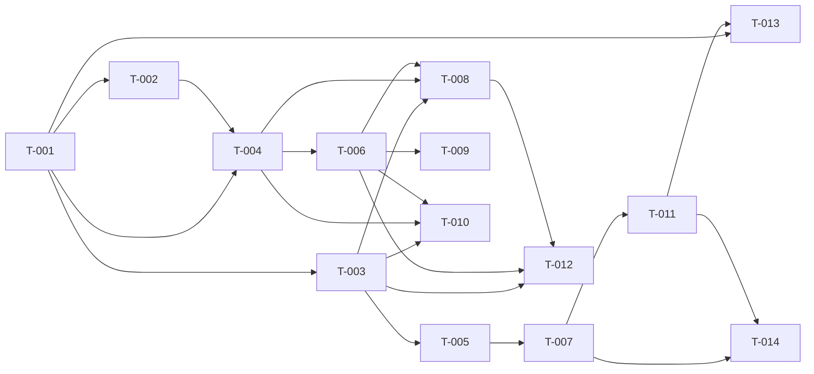

# Build Site — Onboarding

14 tasks across 6 tiers from 2 kits.

---

## Tier 0 — No Dependencies (Start Here)

| Task | Title | Cavekit | Requirement | Effort |
|------|-------|---------|-------------|--------|
| T-001 | Wizard entry points and header | cavekit-onboarding-wizard.md | R1 | S |

## Tier 1 — Depends on Tier 0

| Task | Title | Cavekit | Requirement | blockedBy | Effort |
|------|-------|---------|-------------|-----------|--------|
| T-002 | Returning-user Keep/Reconfigure/Cancel path | cavekit-onboarding-wizard.md | R2 | T-001 | M |
| T-003 | Shared-token CSPRNG generation and secure storage | cavekit-onboarding-wizard.md | R4 | T-001 | M |

## Tier 2 — Depends on Tier 1

| Task | Title | Cavekit | Requirement | blockedBy | Effort |
|------|-------|---------|-------------|-----------|--------|
| T-004 | Five-prompt sequence with masking and defaults | cavekit-onboarding-wizard.md | R3 | T-001, T-002 | M |
| T-005 | Backend configuration status detection | cavekit-onboarding-backend.md | R1 | T-003 | S |

## Tier 3 — Depends on Tier 2

| Task | Title | Cavekit | Requirement | blockedBy | Effort |
|------|-------|---------|-------------|-----------|--------|
| T-006 | Preflight checks with per-failure remediation | cavekit-onboarding-wizard.md | R6 | T-004 | L |
| T-007 | Backend TTY-aware first-run prompt | cavekit-onboarding-backend.md | R2 | T-005 | S |

## Tier 4 — Depends on Tier 3

| Task | Title | Cavekit | Requirement | blockedBy | Effort |
|------|-------|---------|-------------|-----------|--------|
| T-008 | Bot env file generation with preflight gate | cavekit-onboarding-wizard.md | R5 | T-004, T-003, T-006 | M |
| T-009 | Retry-single-field loop on preflight failure | cavekit-onboarding-wizard.md | R7 | T-006 | M |
| T-010 | Logging safety audit (secret redaction) | cavekit-onboarding-wizard.md | R9 | T-004, T-003, T-006 | S |
| T-011 | Backend Y/n response handling with retries | cavekit-onboarding-backend.md | R3 | T-007 | S |

## Tier 5 — Depends on Tier 4

| Task | Title | Cavekit | Requirement | blockedBy | Effort |
|------|-------|---------|-------------|-----------|--------|
| T-012 | Wizard success path atomic two-file commit | cavekit-onboarding-wizard.md | R8 | T-003, T-008, T-006 | M |
| T-013 | Backend wizard dispatch with inherited stdio | cavekit-onboarding-backend.md | R4 | T-011, T-001 | M |
| T-014 | Backend force re-run CLI flag | cavekit-onboarding-backend.md | R5 | T-007, T-011 | S |

---

## Summary

| Tier | Tasks | Effort |
|------|-------|--------|
| 0 | 1 | 1S |
| 1 | 2 | 2M |
| 2 | 2 | 1S + 1M |
| 3 | 2 | 1S + 1L |
| 4 | 4 | 2S + 2M |
| 5 | 3 | 1S + 2M |

**Total: 14 tasks, 6 tiers**

## Coverage Matrix

**Kit revised 2026-04-20:** prior onboarding-backend R2 (interactive TTY prompt), R3 (Y/n/never), R4 (implicit wizard dispatch), and R5 (force as way to re-prompt) hijacked `music-dl gui` and alienated normal users. Replaced with R2 (non-blocking hint) + R3 (explicit force flag is the only wizard-launch path). Coverage rewritten below.

| Cavekit | Req | Criterion (abbreviated) | Task(s) | Status |
|---------|-----|-------------------------|---------|--------|
| onboarding-backend | R1 | AC1: detect "configured" state from shared-token file | T-005 | COVERED |
| onboarding-backend | R1 | AC2: detect "needs-setup" state when token absent/empty | T-005 | COVERED |
| onboarding-backend | R2 | AC1: needs-setup + TTY → hint line printed | T-NEW-A | COVERED |
| onboarding-backend | R2 | AC2: configured → no output | T-NEW-A | COVERED |
| onboarding-backend | R2 | AC3: hint mentions the retry command | T-NEW-A | COVERED |
| onboarding-backend | R2 | AC4: non-blocking — no prompt, no pause | T-NEW-A | COVERED |
| onboarding-backend | R2 | AC5: non-TTY suppresses hint | T-NEW-A | COVERED |
| onboarding-backend | R3 | AC1: force flag launches wizard as child with inherited stdio | T-NEW-B, T-013 | COVERED |
| onboarding-backend | R3 | AC2: blocks until wizard exit | T-NEW-B, T-013 | COVERED |
| onboarding-backend | R3 | AC3: exit 0 → success message, continues startup | T-NEW-B | COVERED |
| onboarding-backend | R3 | AC4: exit non-zero → retry message, continues startup | T-NEW-B | COVERED |
| onboarding-backend | R3 | AC5: force triggers regardless of current state | T-NEW-B | COVERED |
| onboarding-backend | R3 | AC6: server startup never aborted by wizard failure | T-NEW-B | COVERED |
| onboarding-backend | R3 | AC7: bun unavailable → falls back to node --import tsx | T-013 | COVERED |
| onboarding-wizard | R1 | AC1: standalone command invocation works | T-001 | COVERED |
| onboarding-wizard | R1 | AC2: backend-dispatch invocation with no args works | T-001 | COVERED |
| onboarding-wizard | R1 | AC3: one-line header printed on start | T-001 | COVERED |
| onboarding-wizard | R2 | AC1: valid-config detection prompts Keep/Reconfigure/Cancel | T-002 | COVERED |
| onboarding-wizard | R2 | AC2: Keep exits 0 with no changes | T-002 | COVERED |
| onboarding-wizard | R2 | AC3: Reconfigure proceeds with existing values as defaults | T-002 | COVERED |
| onboarding-wizard | R2 | AC4: Cancel exits non-zero with no changes | T-002 | COVERED |
| onboarding-wizard | R2 | AC5: returning-user path taken regardless of invocation route | T-002 | COVERED |
| onboarding-wizard | R3 | AC1: one-line breadcrumb above each of 5 prompts | T-004 | COVERED |
| onboarding-wizard | R3 | AC2: bot token input is masked | T-004 | COVERED |
| onboarding-wizard | R3 | AC3: non-secret IDs are echoed normally | T-004 | COVERED |
| onboarding-wizard | R3 | AC4: reconfigure shows existing values as default | T-004 | COVERED |
| onboarding-wizard | R3 | AC5: empty required field re-prompts with message | T-004 | COVERED |
| onboarding-wizard | R4 | AC1: CSPRNG ≥256 bits of entropy | T-003 | COVERED |
| onboarding-wizard | R4 | AC2: canonical file mode 0600 | T-003 | COVERED |
| onboarding-wizard | R4 | AC3: parent directories created as needed | T-003 | COVERED |
| onboarding-wizard | R4 | AC4: atomic write (no partial file on crash) | T-003 | COVERED |
| onboarding-wizard | R4 | AC5: reconfigure reuses existing unless explicit rotation | T-003 | COVERED |
| onboarding-wizard | R5 | AC1: env file contains all 7 bot values | T-008 | COVERED |
| onboarding-wizard | R5 | AC2: base URL default local-loopback with override option | T-008 | COVERED |
| onboarding-wizard | R5 | AC3: env file mode 0600 | T-008 | COVERED |
| onboarding-wizard | R5 | AC4: atomic write | T-008 | COVERED |
| onboarding-wizard | R5 | AC5: env file preserved on Keep path | T-002, T-008 | COVERED |
| onboarding-wizard | R5 | AC6: overwritten only on Reconfigure + preflight pass | T-008 | COVERED |
| onboarding-wizard | R5 | AC7: preflight fail leaves original env untouched | T-008 | COVERED |
| onboarding-wizard | R6 | AC1: runtime version check | T-006 | COVERED |
| onboarding-wizard | R6 | AC2: voice cipher availability check | T-006 | COVERED |
| onboarding-wizard | R6 | AC3: media tool (ffmpeg) availability check | T-006 | COVERED |
| onboarding-wizard | R6 | AC4: opus binding loadable check | T-006 | COVERED |
| onboarding-wizard | R6 | AC5: Discord token validity check | T-006 | COVERED |
| onboarding-wizard | R6 | AC6: app id matches token check | T-006 | COVERED |
| onboarding-wizard | R6 | AC7: guild reachable by bot check | T-006 | COVERED |
| onboarding-wizard | R6 | AC8: channel exists/is-text/visible/sendable check | T-006 | COVERED |
| onboarding-wizard | R6 | AC9: user is guild member + bot Connect+Speak perms | T-006 | COVERED |
| onboarding-wizard | R6 | AC10: backend reachable + picked up shared token + per-failure hints | T-006 | COVERED |
| onboarding-wizard | R7 | AC1: field-identifiable failure → re-enter that field only | T-009 | COVERED |
| onboarding-wizard | R7 | AC2: field-unidentifiable failure → remediation + retry/abort | T-009 | COVERED |
| onboarding-wizard | R7 | AC3: user abort → exit non-zero, no config written | T-009 | COVERED |
| onboarding-wizard | R8 | AC1: atomic two-file commit (env + shared-token) | T-012 | COVERED |
| onboarding-wizard | R8 | AC2: prints start command on success | T-012 | COVERED |
| onboarding-wizard | R8 | AC3: does NOT auto-start bot (V1 scope) | T-012 | COVERED |
| onboarding-wizard | R8 | AC4: exit 0 on success | T-012 | COVERED |
| onboarding-wizard | R9 | AC1: Discord bot token never appears in output | T-010 | COVERED |
| onboarding-wizard | R9 | AC2: shared backend token never appears in output | T-010 | COVERED |
| onboarding-wizard | R9 | AC3: generic phrasing when underlying error may contain secrets | T-010 | COVERED |

**Coverage (post-revision): 58/58 criteria (100%) — backend shrank from 20 ACs to 13 after R2/R3/R4/R5 → R2/R3 collapse; wizard unchanged at 45 ACs.**

## Dependency Graph

## Architect Report

### Kits Read: 2
### Tasks Generated: 14
### Tiers: 6
### Tier 0 Tasks: 1 (can run in parallel immediately)

### Next Step
Run `/ck:make` to start implementation.
Run `/ck:make --peer-review` to add Codex review.
