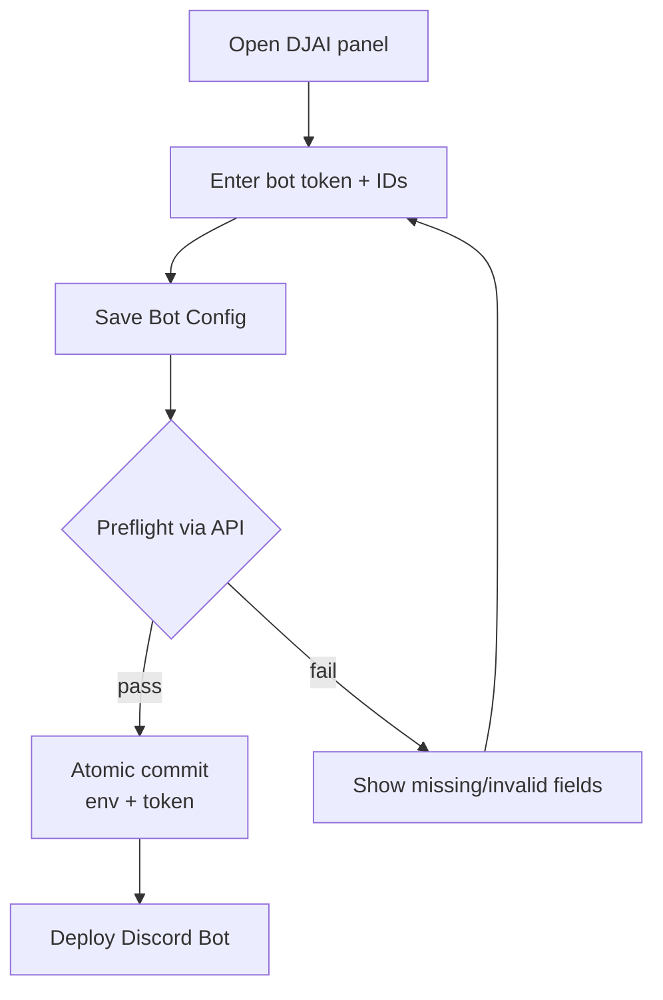
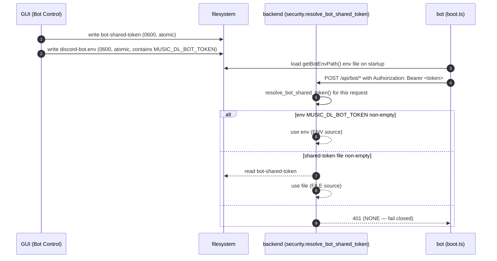

# Discord Bot Onboarding

End-to-end flow for going from zero to a running Discord bot via the
music-dl GUI. Bot setup lives in the **DJAI panel** and is driven by
the **Bot Control** API (`/bot-control/*`).

DJAI hosts automation modules; AI-powered modules can err — see
[`djai-modules.md`](djai-modules.md).

## Design principles

1. **No terminal hijack on normal startup.** `music-dl gui` prints
   the web UI address and serves the app — period. Bot setup is
   GUI-only.
2. **Single authoritative path for every file.** The GUI and the
   backend both resolve the same env file and shared-token file, so
   there is no way for them to disagree on where state lives.
3. **Private per-file writes.** Input is validated before persistence, and
   each config file is replaced atomically with mode `0600`. The two files
   are not committed as one filesystem transaction.

## Entry points

### `music-dl gui` (DJAI panel)

```bash
music-dl gui
```

Open the DJAI view in the web UI. Enter the Discord bot token and
allowed guild/channel/user IDs, then use **Save Bot Config**,
**Deploy Discord Bot**, **Restart**, or **Shutdown** to manage the bot.

The Bot Control API endpoints:

| Endpoint | Purpose |
| --- | --- |
| `GET /bot-control/status` | Current config + bot process state |
| `POST /bot-control/configure` | Save bot config (env + shared token) |
| `POST /bot-control/start` | Deploy / start the bot |
| `POST /bot-control/restart` | Restart the bot |
| `POST /bot-control/stop` | Shut down the bot |

### `music-dl gui --setup-bot`

The `--setup-bot` flag is retained for compatibility but no longer
launches a CLI wizard. It prints a one-line reminder to use the GUI:

```
Discord bot setup is GUI-only. Open `music-dl gui`, go to the DJAI
panel, and use Bot Control (/bot-control) to save config and deploy
the bot.
```

**Server startup is never aborted.** The backend always continues to
its HTTP listen after printing the message.

## First-run hint (non-blocking)

On every `music-dl gui` startup the backend checks whether the bot is
configured:

- **Configured** = the shared-token file exists and is non-empty.
- **Needs setup** = otherwise.

When state is `needs-setup` **and** stdout is a TTY, the backend
prints a single line:

```
Discord bot not configured — open the DJAI panel in `music-dl gui`
and use Bot Control to set it up.
```

It never waits for input, never pauses startup, and is suppressed on
non-TTY launches (daemon, piped, nohup, systemd) so logs stay clean.

## GUI setup flow



### Configuration fields

The GUI collects the same seven values the bot requires at runtime:

- `DISCORD_TOKEN`
- `DISCORD_APPLICATION_ID`
- `ALLOWED_GUILD_ID`
- `ALLOWED_CHANNEL_ID`
- `ALLOWED_USER_ID`
- `MUSIC_DL_BASE_URL`
- `MUSIC_DL_BOT_TOKEN` (shared backend bearer token)

On reconfigure, existing values are loaded from disk so secrets do not
need to be re-entered unless rotated.

## The GUI ↔ backend handoff

The GUI writes config to disk; the backend resolves the shared token
from env or file; the bot loads the env file on startup and
authenticates with the backend.



On startup the backend prints **one line** naming the resolution
source (`env` or the file path) so you can confirm the plumbing is
connected without ever exposing the secret.

## Canonical paths

The bot runtime (TypeScript, `paths.ts`) and the backend
(Python, `bot_onboarding.py`) resolve these identically:

```
override:         $MUSIC_DL_CONFIG_DIR          (wins over XDG)
XDG fallback:     $XDG_CONFIG_HOME/music-dl
last fallback:    $HOME/.config/music-dl
```

Files inside the config dir:

| File | Env override | Purpose |
| --- | --- | --- |
| `discord-bot.env` | `MUSIC_DL_BOT_ENV_PATH` | Bot runtime env (7 vars) |
| `bot-shared-token` | `MUSIC_DL_BOT_TOKEN_PATH` | Backend bearer validation |
| `discord-bot-runtime/` | `MUSIC_DL_BOT_PATH` | Packaged desktop bot source runtime, provisioned from bundled sources |
| `discord-bot.pid` | `MUSIC_DL_BOT_PID_PATH` | GUI-owned bot process marker |

> The bot's `src/boot.ts` reads from `getBotEnvPath()` — **not** from
> `.env` in `cwd`. Matching the GUI write path here closes the
> cwd-vs-config-dir divergence that would otherwise silently split
> state between writer and reader.

The desktop **Deploy Discord Bot** control launches `bun src/boot.ts`
directly from `discord-bot-runtime/` so the recorded PID belongs to the
long-running bot process.

### Changing the shared token

The GUI creates a shared token when none exists and reuses it on later saves;
there is no separate Rotate control. The backend resolves the environment or
token-file value for each authenticated bot request. The bot loads
`discord-bot.env` only when its process starts, so restart the bot from the
DJAI panel after manually recreating the shared token. If the backend uses the
`MUSIC_DL_BOT_TOKEN` environment override, restart `music-dl gui` after
changing that process environment.

## Logging safety

- The Discord bot token never appears in GUI logs or API responses
  in plaintext after save.
- The generated shared backend token never appears in output.
- Preflight failure messages use generic phrasing rather than raw
  HTTP response bodies.

## Files on disk after a successful setup

```
<config-dir>/
├── discord-bot.env      ← 7 required vars, 0600
└── bot-shared-token     ← URL-safe token generated from 32 random bytes, 0600
```

Where `<config-dir>` resolves to the first non-empty of
`$MUSIC_DL_CONFIG_DIR`, `$XDG_CONFIG_HOME/music-dl`,
`$HOME/.config/music-dl`.

Deploying the bot can also provision `discord-bot-runtime/` and creates
`discord-bot.pid` while the managed process is running.

## Related

- [`djai-modules.md`](djai-modules.md) — DJAI module list
- [`apps/discord-bot/README.md`](../../apps/discord-bot/README.md) —
  bot runtime, commands, architecture
